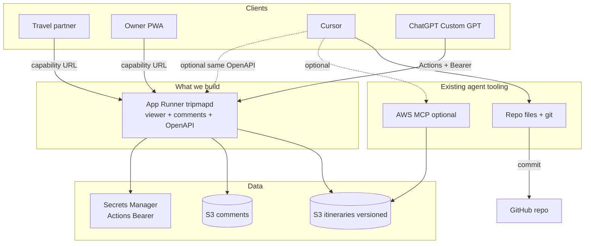

# AWS deployment plan

Authoritative plan for hosting tripmap **beyond** the current GitHub Pages static PWA.  
Companion: [itinerary-display-viewer.md](itinerary-display-viewer.md) (product/architecture), [itinerary-display-ux.md](itinerary-display-ux.md) (UI).

**Status:** design — not implemented.  
**Current production:** static bundles on GitHub Pages (`www.sheffer.org/tripmap/`).

---

## Locked decisions

| Topic | Decision |
|-------|----------|
| Edge CDN | **No CloudFront / WAF** in v1 — App Runner HTTPS only |
| S3 encryption | **SSE-S3** (default); no SSE-KMS |
| Infra as code | **Console** setup for v1 (not Terraform/CDK); agent assists with click-paths and policies |
| Viewer access | **Capability URL** (unguessable token in path) — no separate comments login |
| Comments visibility | **Shared** with anyone who has the capability URL |
| Comments writes | **Anyone with the URL can edit** comments |
| Comments offline | Read from cache; **no writes** offline; no device-only notes fallback |
| Custom tripmap MCP | **No** — do not build `/mcp` on App Runner |
| Cursor agents | **Repo + git** for YAML; optional **AWS MCP** (official) for direct S3 get/put. No custom MCP. |
| ChatGPT agents | **Custom GPT + Actions (OpenAPI)**; Bearer stored encrypted in the GPT editor |
| Agent API | Thin authenticated **OpenAPI** on App Runner (`/openapi.yaml` + `/api/agent/*`) — used by ChatGPT; Cursor may call it too or use AWS MCP + local files |
| Patch retries | **`Idempotency-Key` required** on mutating agent API calls |
| Delete trip | **Omit** initially |
| Source of truth (live) | **S3** — App Runner / viewer always read S3 |
| Schema evolution | **`schema_version`** in YAML + server validate/migrate |
| GitHub YAML | Cursor edits `itineraries/{id}.yaml` and commits; sync to/from S3 via OpenAPI and/or AWS MCP (explicit, not auto) |
| Public hostname (v1) | **Raw App Runner URL** (`*.awsapprunner.com`) |
| Cursor AWS IAM | Only if using **AWS MCP** — then your AWS login / IAM user-role via OAuth or local creds. App Runner still has its own instance role. |

---

## Goals

| Requirement | Approach |
|-------------|----------|
| Run application code on AWS | **AWS App Runner** |
| Canonical itinerary YAML | **Versioned S3** |
| User comments (synced) | **Separate unversioned S3** |
| Agent edits (ChatGPT) | Custom GPT **Actions** → OpenAPI Bearer |
| Agent edits (Cursor) | Local YAML + git; optional AWS MCP ↔ S3; or same OpenAPI |
| Persist to GitHub | Natural Cursor/git workflow on `itineraries/` |
| Viewer + comments | Capability URL `/t/{id}/{token}/` |
| Offline comments | Cached read-only |

### Non-goals (this plan)

- Custom MCP server in `tripmapd`
- CloudFront / WAF
- Terraform/CDK for v1
- Multi-tenant SaaS
- Device-only notes

---

## Target architecture (simplified)



**Why this is simpler:** one HTTP app (viewer + comments + OpenAPI). Cursor and ChatGPT use **existing** product surfaces (workspace/git, AWS MCP, Custom GPT Actions) instead of a bespoke MCP protocol on App Runner.

### Why App Runner

- HTTPS + TLS, container deploy, no ECS/EKS.
- Serves capability-URL PWA, comments API, agent OpenAPI, bundle regeneration.
- **v1 URL:** `https://<service-id>.<region>.awsapprunner.com`

---

## Components

| Component | Responsibility |
|-----------|----------------|
| **App Runner `tripmapd`** | Viewer, comments, OpenAPI agent API, bundle from YAML |
| **S3 itineraries** | Live YAML; versioning ON |
| **S3 comments** | Day notes; versioning OFF |
| **ECR** | Container image |
| **Secrets Manager** | **Agent Bearer** for OpenAPI / GPT Actions |
| **IAM — App Runner role** | Least-privilege S3 + read agent secret |
| **AWS MCP (optional, Cursor)** | Official AWS MCP → S3 under your IAM (not App Runner’s role) |
| **Custom GPT** | Actions → OpenAPI; encrypted API key in GPT settings |

### Request surface

| Surface | Audience | Auth |
|---------|----------|------|
| `GET /t/{id}/{token}/…` | Anyone with link | Capability URL |
| Comments under that prefix | Same | Same token |
| `GET /health` | Probes | Public |
| `GET /openapi.yaml` | GPT editor / humans | Public (spec only; no secrets) |
| `/api/agent/*` | ChatGPT Actions (and Cursor if desired) | **Bearer** |

No public trip index (protects capability URLs). `list_trips` is Bearer-authenticated.

---

## Data model

### Itineraries (versioned S3)

```
s3://tripmap-itineraries-{account}-{region}/
  itineraries/
    holland.yaml       # schema_version + trip body
    holland.meta.json  # token_hash, created_at (not in git)
```

- Object versioning ON; SSE-S3.
- Capability token **hashed** in meta; never commit tokens to git.
- ID regex: `^[a-z0-9][a-z0-9_-]{0,63}$`.
- Rollback via agent API `restore_version` (no delete in v1).

**Schema versioning:** `schema_version: N` in every YAML; server rejects/migrates; `GET /api/agent/schema` returns current schema + version.

### Bundles

Write-through after successful YAML mutation; on-demand regenerate if missing. Store under App Runner disk and/or `bundles/{id}/` in S3.

### Comments

```
s3://tripmap-comments-…/{tripId}/days/{n}.json
```

Last-write-wins + optional `If-Match` ETag.

### Offline comments

| Online | Offline |
|--------|---------|
| GET → cache | Serve cache |
| PUT | UI blocked |

---

## AuthN / AuthZ

### Capability URL (viewer + comments)

```
https://<app-runner-host>/t/{id}/{token}/
```

Anyone with the link: read itinerary, read/write comments. Rotate via agent API. `Referrer-Policy: no-referrer`.

```http
GET  /t/{id}/{token}/api/comments
PUT  /t/{id}/{token}/api/comments/{day}
```

### Agent OpenAPI (ChatGPT Actions; optional for Cursor)

| Item | Choice |
|------|--------|
| Mechanism | `Authorization: Bearer <agent_token>` |
| Storage | Secrets Manager → App Runner; **same value** pasted into Custom GPT Actions (OpenAI encrypts at rest in GPT config) |
| Rotation | New secret → update Secrets Manager + GPT Actions → revoke old |

### Cursor (no custom MCP)

| Path | When to use |
|------|-------------|
| Edit `itineraries/*.yaml` + `git commit` | Default for planning and GH history |
| **AWS MCP** → S3 `PutObject` / `GetObject` | Push/pull live YAML without going through App Runner (still must trigger regenerate — prefer OpenAPI `put_yaml` so bundle rebuilds) |
| OpenAPI Bearer from Cursor | Same as ChatGPT; ensures validation + bundle write-through |

**Recommendation:** Cursor publishes live changes via **OpenAPI `put_yaml` / `patch_trip`** (correct validation + regenerate). Use AWS MCP only for break-glass / inspection, or accept that raw S3 puts need a follow-up `POST /api/agent/trips/{id}/regenerate`.

### Agent API operations (v1)

| Operation | Effect |
|-----------|--------|
| `GET /api/agent/trips` | List IDs |
| `GET /api/agent/trips/{id}` | Structured trip JSON |
| `GET /api/agent/trips/{id}/yaml` | Full YAML text |
| `PUT /api/agent/trips/{id}/yaml` | Replace YAML (**Idempotency-Key**) |
| `PATCH /api/agent/trips/{id}` | Structured patch (**Idempotency-Key**) |
| `POST /api/agent/trips` | Create trip + capability token + `viewer_url` |
| `GET /api/agent/schema` | JSON Schema + version |
| `GET /api/agent/trips/{id}/viewer-url` | Capability URL |
| `POST /api/agent/trips/{id}/rotate-token` | New URL |
| `GET /api/agent/trips/{id}/versions` | List S3 versions |
| `POST /api/agent/trips/{id}/restore` | Restore version |

No delete in v1.

### Cursor ↔ GitHub workflow

| Intent | Steps |
|--------|--------|
| Edit for GH | Change `itineraries/{id}.yaml` → commit → push |
| Publish live | `PUT .../yaml` (or patch) with Bearer → S3 + bundle |
| Pull live into repo | `GET .../yaml` → overwrite local file → commit |
| ChatGPT on the road | Actions mutate S3; later Cursor pulls YAML into git if desired |

---

## Security architecture

| Threat | Mitigations |
|--------|-------------|
| Leaked agent Bearer | Rotate; Secrets Manager; rate limit; S3 versions; don’t log Authorization |
| Leaked capability URL | Rotate token; HTTPS; no-referrer |
| Guessed URL | 128-bit token; no public index; rate-limit 404s |
| ID injection | Strict regex; server-built keys |
| Bundle SSRF | `https:` photos only; fixed OSRM URL |
| Over-broad AWS MCP | IAM user/role scoped to itineraries (+ comments if needed) prefixes only — **manual IAM help required** |
| App Runner compromise | Least-privilege instance role; separate buckets |

### IAM — App Runner instance role

```text
s3: List/Get/Put on itineraries prefix; GetObjectVersion + ListBucketVersions
s3: List/Get/Put/Delete on comments prefix
secretsmanager:GetSecretValue on agent Bearer secret ARN
# no DeleteObject on itineraries in v1
```

### IAM — Cursor AWS MCP (optional)

Separate role/user: same itineraries prefix read/write; **no** need for Secrets Manager; prefer no comments access unless intentional.

---

## PWA changes

| Area | Change |
|------|--------|
| Origin | App Runner URL |
| Routing | `/t/{id}/{token}/` |
| Comments | REST under prefix; offline read cache |
| SW | Cache bundle + comments GET; no queued writes |
| Title / OG | Keep build-time injection |

---

## Manual config work (agent-assisted)

Console-heavy steps. **You run the AWS/OpenAI/Cursor UI; the agent provides exact click-paths, JSON policies, values to paste, and verifies via CLI (`aws`, `curl`, `gh`) where possible.** Mark each item when done.

### M1 — AWS account hygiene

- [ ] Confirm account/region (prefer one region, e.g. `eu-west-1` or `us-east-1`)
- [ ] Enable **AWS Budget** alert (e.g. $20/$50)
- [ ] Agent: draft budget JSON / console steps

### M2 — S3 buckets

- [ ] Create `tripmap-itineraries-…` — Block Public Access ON, versioning **ON**, SSE-S3
- [ ] Create `tripmap-comments-…` — Block Public Access ON, versioning **OFF**, SSE-S3
- [ ] Agent: bucket names, CORS if needed (usually none), verify with `aws s3api get-bucket-versioning`

### M3 — Secrets Manager

- [ ] Create secret `tripmap/agent-bearer` (random 32+ bytes)
- [ ] Agent: generate token (`openssl rand -hex 32`), confirm secret ARN for App Runner
- [ ] **Never** commit the token; store in password manager too

### M4 — IAM role for App Runner

- [ ] Trust policy for App Runner
- [ ] Permissions policy (least privilege above)
- [ ] Agent: full policy JSON + attach steps; verify with IAM policy simulator if useful

### M5 — ECR + first image

- [ ] Create ECR repo `tripmapd`
- [ ] Agent: `docker build` / `docker push` commands (or GitHub Actions later)
- [ ] Note image URI for App Runner

### M6 — App Runner service

- [ ] Create service from ECR image
- [ ] Attach instance role; inject env: buckets, region, `PUBLIC_BASE_URL`, `OSRM_BASE_URL`, secret ref for Bearer
- [ ] Health check → `/health`
- [ ] Agent: env table to paste; after deploy, record default HTTPS URL
- [ ] Smoke: `curl /health`

### M7 — Seed itineraries

- [ ] Upload `holland.yaml` / `nz-4weeks.yaml` with `schema_version`
- [ ] Generate capability tokens; write `*.meta.json` hashes (agent script or one-shot CLI)
- [ ] Call create/regenerate so bundles exist
- [ ] Agent: provide upload commands + print **viewer URLs** (save offline; treat as secrets)

### M8 — Custom GPT (ChatGPT)

- [ ] Create GPT; paste instructions (“edit tripmap via Actions; GET before PATCH/PUT; never invent coords”)
- [ ] Actions → import `https://<app-runner>/openapi.yaml`
- [ ] Authentication → API Key → Bearer → paste agent token (**encrypted by OpenAI**)
- [ ] Agent: draft GPT instructions + test prompt checklist (“list trips”, “show holland day 4”, “patch notes”)
- [ ] Verify Action calls succeed in GPT builder test panel

### M9 — Cursor (local + optional AWS MCP)

- [ ] Confirm repo clone; agent can edit `itineraries/` and commit as today
- [ ] Optional: add **AWS MCP** in Cursor MCP settings (official AWS endpoint / OAuth)
- [ ] Optional: IAM user or SSO role scoped to itineraries bucket for AWS MCP
- [ ] Optional: store App Runner Bearer in Cursor env/secret for OpenAPI calls (or use `curl` recipes in a skill)
- [ ] Agent: `mcp.json` snippet, IAM policy for AWS MCP, and a short Cursor rule/skill: “publish via PUT yaml; pull before commit when syncing from ChatGPT”

### M10 — Cutover from GitHub Pages

- [ ] Share App Runner capability URLs with partner
- [ ] Keep Pages live until URLs verified
- [ ] Update README “live URLs” section
- [ ] Agent: PR text for README; deprecate Pages workflow when ready

### M11 — Drills (with agent)

- [ ] Rotate agent Bearer (Secrets Manager + GPT Actions)
- [ ] Rotate one capability token; confirm old URL 404s
- [ ] Restore prior S3 YAML version after a bad PUT
- [ ] Confirm Budget alarm email works

---

## Implementation phases

### Phase A — Foundation + manual M1–M6

- [ ] Console work M1–M6 (agent-assisted)
- [ ] `cmd/tripmapd`: `/health`, static stub, Bearer middleware for `/api/agent/*`
- [ ] CloudWatch 5xx + auth-failure filters

### Phase B — Itineraries + OpenAPI

- [ ] S3 YAML + versions + `schema_version`
- [ ] OpenAPI + handlers (table above); Idempotency-Key; quotas
- [ ] Bundle write-through; capability tokens
- [ ] Seed data (M7)
- [ ] Custom GPT setup (M8)

### Phase C — Comments + PWA

- [ ] Comments under `/t/{id}/{token}/api/…`
- [ ] PWA online write / offline read-only
- [ ] CSP + Referrer-Policy

### Phase D — Cursor ergonomics

- [ ] Cursor rule/skill for publish/pull (M9)
- [ ] Optional AWS MCP wiring
- [ ] Document “ChatGPT changed S3 → pull into git”

### Phase E — Hardening

- [ ] Rotation + restore drills (M11)
- [ ] Image scan in CI
- [ ] Cutover (M10)

---

## Configuration (runtime)

| Name | Where | Notes |
|------|-------|-------|
| `AGENT_BEARER_TOKEN` | Secrets Manager → App Runner | GPT Actions + optional Cursor |
| `ITINERARIES_BUCKET` | Env | |
| `COMMENTS_BUCKET` | Env | |
| `AWS_REGION` | Env | |
| `PUBLIC_BASE_URL` | Env | App Runner default URL |
| `OSRM_BASE_URL` | Env | Fixed allowlist |
| `MAX_YAML_BYTES` | Env | e.g. 512KiB |

---

## Cost sketch

| Item | Notes |
|------|-------|
| App Runner | Main cost |
| S3 + versions | Low |
| Secrets Manager | ~$0.40/secret/month |
| AWS MCP | No extra MCP fee; pay for API/S3 usage only |
| CloudFront / WAF | $0 (skipped) |

---

## Migration from GitHub Pages

1. Complete M1–M7 (infra + seed).
2. Deploy `tripmapd`; verify capability URL + agent OpenAPI.
3. Complete M8 (Custom GPT).
4. Complete M9 (Cursor habits / optional AWS MCP).
5. Share new URLs; M10 cutover when stable.

---

## Relation to existing roadmap

Replaces Fly.io / “API commits to git” and **drops custom MCP**. Live data in S3; ChatGPT via **Actions**; Cursor via **git + optional AWS MCP / OpenAPI**. GitHub Pages remains until capability URLs replace shared links.

---

## Acceptance criteria

- [ ] Capability URL: itinerary + shared comments; both parties can edit notes
- [ ] Unknown token → 404; offline comments read-only
- [ ] Custom GPT Actions (Bearer in GPT config) can list/get/put/patch/restore/rotate
- [ ] Cursor can maintain `itineraries/*.yaml` in git and publish/pull via OpenAPI (and/or AWS MCP + regenerate)
- [ ] No custom `/mcp` endpoint required
- [ ] Invalid id / oversized / bad schema version rejected
- [ ] Bearer leak and URL leak recoverable via rotation runbooks
- [ ] No secrets in git; Budget alarm on
- [ ] Manual checklist M1–M11 completed once with agent help
