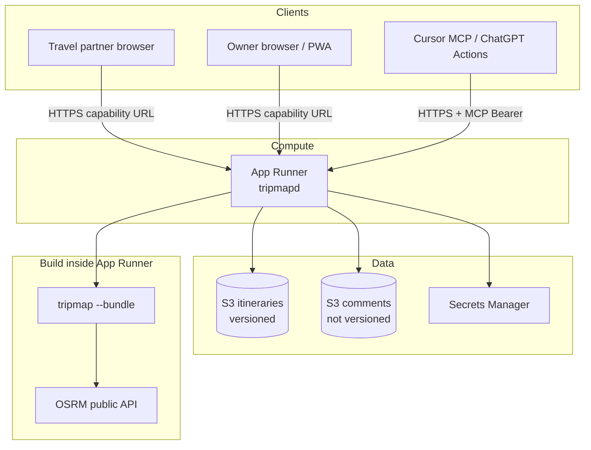

# AWS deployment plan

Authoritative plan for hosting tripmap **beyond** the current GitHub Pages static PWA.  
Companion: [itinerary-display-viewer.md](itinerary-display-viewer.md) (product/architecture), [itinerary-display-ux.md](itinerary-display-ux.md) (UI).

**Status:** design — not implemented.  
**Current production:** static bundles on GitHub Pages (`www.sheffer.org/tripmap/`).

---

## Locked decisions

| Topic | Decision |
|-------|----------|
| Edge CDN | **No CloudFront / WAF** in v1 — App Runner HTTPS only |
| S3 encryption | **SSE-S3** (default); no SSE-KMS |
| Infra as code | **Console** setup for v1 (not Terraform/CDK) |
| Viewer access | **Capability URL** (unguessable token in path) — no separate comments login |
| Comments visibility | **Shared** with anyone who has the capability URL (partners included) |
| Comments writes | **Anyone with the URL can edit** comments (owner and partner alike) |
| Comments offline | Read from cache; **no writes** offline; no device-only `localStorage` fallback |
| MCP auth | Bearer token (see [ChatGPT / Cursor](#chatgpt-and-cursor-auth) below) |
| Agent protocols | **Cursor → MCP**; **ChatGPT → Custom GPT Actions (OpenAPI)** so the Bearer is stored encrypted in the GPT editor. Same server secret and handlers. Optional ChatGPT MCP later if useful |
| Patch retries | **`Idempotency-Key` required** on mutating MCP tools |
| MCP delete trip | **Omit** initially (S3 versions remain; no delete tool) |
| Source of truth (live) | **S3** after cutover — App Runner / viewer always read S3 |
| Schema evolution | **Version the itinerary schema** (e.g. `schema_version` in YAML + server-side migrations / compatibility) |
| GitHub YAML | **Supported via Cursor MCP** — full YAML read/write so the agent can mirror into `itineraries/{id}.yaml` and commit/push to GH (backup, review, local CLI). Not an automatic bi-directional sync; Cursor-driven |
| Public hostname (v1) | **Raw App Runner URL** (`*.awsapprunner.com`). Custom domain / GH Pages path mapping deferred |
| Cursor AWS IAM | **Not needed** — Cursor talks HTTPS→MCP only; only App Runner’s instance role touches S3 |

---

## Goals

| Requirement | Approach |
|-------------|----------|
| Run application code on AWS | **AWS App Runner** (HTTPS service) |
| Canonical itinerary YAML | **Versioned S3** bucket (object versioning on) |
| User comments (synced) | **Separate S3** bucket (**no** versioning) |
| Agent edits itineraries | **Authenticated MCP** (Bearer) — read / patch / **put full YAML** / create + schema |
| Persist YAML to GitHub | Cursor uses MCP `get_yaml` / `put_yaml` and writes the same document into the repo for commit |
| Viewer + comments | **One capability URL per trip**; comments REST keyed by that URL (no bearer for browsers) |
| Stable viewer URLs | App Runner paths like `/t/{id}/{token}/` |
| Multiple itineraries | Named objects `itineraries/{id}.yaml`; MCP can **create** |
| Offline comments | Cache last fetch; **read-only** offline |

### Non-goals (this plan)

- CloudFront, WAF, custom AWS CDN setup
- Replacing OSRM with a self-hosted router
- Multi-tenant SaaS
- Real-time collaborative YAML editing
- Photos as primary S3 binaries (keep HTTPS URLs in YAML)
- Device-only notes when “unauthenticated”

---

## Target architecture



### Why App Runner

- Managed HTTPS + TLS, simple container deploy, no ECS/EKS.
- One Go binary: static viewer, comments REST, MCP server for agents.
- **v1 public URL:** default App Runner hostname  
  `https://<service-id>.<region>.awsapprunner.com`  
  Custom domain deferred (GH Pages path mapping is awkward without CloudFront).

---

## Components

| Component | Responsibility |
|-----------|----------------|
| **App Runner** | HTTP API + MCP + serve/regenerate viewer |
| **S3 itineraries** | `itineraries/{id}.yaml` — source of truth; **versioning ON** |
| **S3 comments** | Per-trip/day JSON — **versioning OFF** |
| **ECR** | Container images |
| **Secrets Manager** | MCP bearer token(s) only (viewer uses capability URLs, not a second API key in the browser) |
| **IAM — App Runner instance role** | Least-privilege S3 + read MCP secret |
| **IAM — Cursor / ChatGPT** | **None.** Agents never hold AWS keys; they call App Runner over HTTPS |

### Request surface

| Surface | Audience | Auth |
|---------|----------|------|
| `GET /t/{id}/{token}/…` | Anyone with the link | **Capability URL** (token ∊ URL) |
| Comments REST under that prefix | Same | Same token in path (or validated cookie derived from it) |
| `GET /health` | Load balancers | Public |
| MCP `/mcp` | Cursor (agents) | **`Authorization: Bearer <mcp_token>`** |
| OpenAPI `/api/agent/*` + `/openapi.yaml` | ChatGPT Actions | **Same Bearer** |
| Admin (list versions, restore) | Agent via MCP | MCP bearer |

No public trip index listing all IDs (would defeat capability URLs). MCP `list_trips` is authenticated.

---

## Data model

### Itineraries (versioned S3)

```
s3://tripmap-itineraries-{account}-{region}/
  itineraries/
    holland.yaml          # includes schema_version; metadata: capability token hash
    nz-4weeks.yaml
  # Object Versioning: Enabled  (YAML content history)
  # Encryption: SSE-S3 (default)
```

**Schema versioning:** every itinerary YAML carries `schema_version: N` (integer). The server:

- rejects writes with unknown / future versions it cannot handle;
- may migrate older versions on read or on patch (document migrations in code);
- exposes the current schema via MCP `get_schema` (include version in the schema document).

S3 **object** versioning remains orthogonal (undo bad patches). Schema versioning is about document shape evolution.

Store the **capability token** (or a hash of it) in object metadata or a small sidecar `itineraries/{id}.meta.json` so the server can authorize `/t/{id}/{token}/`. Prefer **hashing** the token at rest (like a password): store `token_hash`, compare on request.

- **ID** = YAML key stem (`holland`), strict regex `^[a-z0-9][a-z0-9_-]{0,63}$`.
- MCP `create` / `patch` → validate → `PutObject` (new version).
- Rollback = MCP `restore_version` (copy prior version → current). **No delete tool** in v1.

### Derived bundles

**Write-through on mutation (v1):** after successful YAML put, regenerate bundle to local disk or `s3://…/bundles/{id}/` and serve from App Runner.  
No CloudFront cache invalidation to worry about.

On-demand regenerate remains a fallback if a bundle is missing.

### Comments (unversioned S3)

```
s3://tripmap-comments-{account}-{region}/
  {tripId}/
    days/
      1.json    # { "text": "...", "updated_at": "..." }
# Versioning: Disabled
```

**Conflict policy:** last-write-wins with `If-Match` ETag when possible.

### Offline comments

| Online | Offline |
|--------|---------|
| `GET` → cache | Serve cache |
| `PUT`/`PATCH` | UI rejects (“Connect to save”) |

No queued offline writes; no parallel “device only” notes feature.

---

## AuthN / AuthZ

### Capability URL (viewer + comments)

```
https://<app-runner-host>/t/{id}/{token}/
```

| Property | Choice |
|----------|--------|
| Token | 128+ bits unguessable (`crypto/rand`); shown once on create / rotate |
| Grants | Read itinerary bundle **and** read/write comments for that trip (**any** holder of the URL may edit notes) |
| Partners | Share the same URL — they see comments too |
| Agent | MCP `get_viewer_url` returns this URL (agent **will** see the secret — accepted) |
| Rotation | MCP `rotate_viewer_token` → new URL; old URL 404s |
| Leak paths | Chat logs, Referer, history, screenshots — treat like a password; rotate if leaked |

**No separate browser bearer / login** for comments in v1.

Comment API shape (conceptual):

```http
GET  /t/{id}/{token}/api/comments
PUT  /t/{id}/{token}/api/comments/{day}
```

Server: verify token for `{id}`, then S3. Timing-safe compare on hash.

### MCP (agents only)

| Item | Choice |
|------|--------|
| Mechanism | `Authorization: Bearer <mcp_token>` |
| Storage | Secrets Manager → App Runner env |
| Scope | All trips in this deployment (single-tenant) |
| Rotation | New secret → update ChatGPT/Cursor → revoke old |

#### ChatGPT and Cursor auth

| Client | How auth works |
|--------|----------------|
| **Cursor** | **MCP** — remote server URL + `Authorization: Bearer <token>`. No AWS IAM on the Cursor side. |
| **ChatGPT** | **Custom GPT Actions** — import `GET /openapi.yaml`; Authentication → API Key → Auth Type **Bearer**. OpenAI **encrypts and stores** the key in the GPT config (good secret UX). Calls hit the same App Runner handlers as MCP tools. |

Same Bearer secret in Secrets Manager. Two front doors, one authorization realm:

- `/mcp` — Cursor (and any future ChatGPT MCP connector)
- OpenAPI paths (e.g. `/api/agent/...`) — ChatGPT Actions

Actions is not “less secure than MCP”; for ChatGPT it is often the **better** place to keep the agent credential. We had dropped it only to avoid a second protocol — that was the wrong tradeoff given Actions’ encrypted key storage.

### MCP tools (v1)

| Tool | Effect |
|------|--------|
| `list_trips` | List itinerary IDs |
| `get_trip` | Trip summary / structured JSON from YAML |
| `get_yaml` | **Full YAML text** (for editing and GH persistence) |
| `put_yaml` | **Replace** entire YAML in S3 after schema validation (**requires Idempotency-Key**) |
| `get_schema` | JSON Schema for YAML (+ `schema_version`) |
| `create_trip` | New YAML + capability token + viewer URL |
| `patch_trip` | Structured patch + validate + put (**requires Idempotency-Key**) |
| `get_viewer_url` | Capability URL for `{id}` |
| `rotate_viewer_token` | Invalidate old link; issue new |
| `list_yaml_versions` / `restore_version` | S3 version rollback |

No `delete_trip` in v1.

### Cursor ↔ GitHub YAML workflow

Live viewer data stays in **S3**. GitHub is the place for diffable backups and local `tripmap` CLI — maintained **through Cursor**, not a nightly job.

Typical flows:

| Intent | Steps |
|--------|--------|
| Edit in S3, then commit to GH | `get_yaml` → write `itineraries/{id}.yaml` in the workspace → `git commit` / push |
| Edit in the repo, publish live | Read local YAML → `put_yaml` (or `patch_trip`) → S3 + bundle regenerate |
| ChatGPT on the road | Custom GPT **Actions** against S3 (Bearer in GPT config); Cursor later `get_yaml` if you want GH updated |

Rules:

- `put_yaml` / `patch_trip` always validate `schema_version` and the schema before S3 write.
- Repo files are **not** auto-updated when ChatGPT patches S3 — Cursor (or you) runs an explicit pull-to-repo when you want GH current.
- Do not store capability tokens in committed YAML; tokens live in S3 metadata / sidecar only.

---

## Security architecture

### Threat model

| Threat | Impact | Mitigations |
|--------|--------|-------------|
| Leaked MCP token | Rewrite itineraries | Rotate; Secrets Manager; rate limit; S3 versions + restore; don’t log Authorization |
| Leaked capability URL | Read/write that trip’s comments + read itinerary | Rotate token; HTTPS only; `Referrer-Policy: no-referrer`; avoid putting URL in third-party image `Referer` |
| Guessed capability URL | Same | 128-bit token; no trip index; rate-limit 404s on `/t/*` |
| Path traversal / ID injection | Cross-trip access | Strict id regex; server builds S3 keys; constant-time token check |
| Prompt injection in YAML | Agent misbehavior | Don’t store secrets in YAML; agent policies |
| Bundle SSRF (`photo:`) | SSRF | `https:` only; timeouts; size caps; fixed OSRM URL |
| Comment overwrite | Lost notes | ETag / If-Match |
| App Runner compromise | Bucket access | Least-privilege IAM; separate buckets; no long-lived keys in image |
| Cost bomb | Bill shock | Max YAML size; max trips; in-process rate limits; **AWS Budget alarm** |

### IAM (App Runner instance role only)

```text
s3:ListBucket / GetObject / PutObject on itineraries prefix
s3:GetObjectVersion / ListBucketVersions on itineraries bucket
# no DeleteObject / DeleteObjectVersion in v1

s3:ListBucket / GetObject / PutObject / DeleteObject on comments prefix only

secretsmanager:GetSecretValue on the MCP secret ARN only
```

### Encryption & edge

| Layer | v1 |
|-------|-----|
| S3 | SSE-S3 |
| TLS | App Runner HTTPS |
| CDN / WAF | **None** |
| Security headers | CSP, `Referrer-Policy: no-referrer`, `X-Frame-Options` |
| Rate limits | In-process on `/mcp`, `/api/agent/*`, and `/t/*` token failures |

### Input validation

- YAML max **512 KiB**; known structs; enum types; finite coords.
- Comments max **8 KiB**/day; plain text.
- Idempotency keys retained (e.g. 24h in memory or small S3/Dynamo) for `patch_trip`.

### Audit & recovery

- CloudWatch: 5xx, MCP 401s, capability 404 bursts.
- AWS Budget alert day one.
- YAML recovery: S3 versions + `restore_version`.
- Comments: no versions — accept lossier recovery; optional infrequent backup later.
- Live recovery: S3 object versions + `restore_version`.
- GitHub copy: refreshed when Cursor runs `get_yaml` → repo file → commit (see workflow above).

---

## MCP design notes

- After `create` / `patch_trip` / `put_yaml`: regenerate bundle; return `{ "id", "viewer_url", "version_id", "schema_version" }`.
- Mutating tools accept and honor **`Idempotency-Key`**.
- Quotas: e.g. max 50 itineraries; ~1 mutating call / 2s / token.
- `get_schema` returns the current schema **and** its version; reject/migrate writes with older or unknown `schema_version` per server rules.
- Prefer `patch_trip` for small agent edits; use `put_yaml` when Cursor (or you) is replacing the whole document from a repo file.

---

## PWA changes

| Area | Change |
|------|--------|
| Origin | Raw App Runner URL (custom domain later if needed) |
| Routing | Load from `/t/{id}/{token}/` |
| Comments | REST under that prefix; offline **read cache** only |
| Auth UX | None beyond “open the link” |
| SW | Cache bundle + comments GET; never queue writes |
| Title / OG | Keep build-time title injection |

---

## Migration from GitHub Pages

1. **Console:** create two buckets (versioning on itineraries only), ECR, App Runner, Secrets Manager secret, instance role, Budget alarm.
2. Upload current `itineraries/*.yaml` into S3 with `schema_version`; generate capability tokens; store hashes. **S3 is canonical thereafter** — stop treating git YAML as live.
3. Deploy `tripmapd`; verify MCP (Cursor + ChatGPT) + capability URL + shared comment edits.
4. Share App Runner capability URLs; Pages can linger briefly, then deprecate.
5. Point both agents at the MCP endpoint.

---

## Implementation phases

### Phase A — Foundation

- [ ] Console: buckets, IAM role, ECR, App Runner, Secrets Manager, Budget
- [ ] `cmd/tripmapd`: health, capability-URL static serve stub, MCP Bearer middleware
- [ ] CloudWatch basic alarms + rotation runbook

### Phase B — Itineraries + MCP

- [ ] S3 YAML load/save + object versions + `schema_version`
- [ ] MCP tools for Cursor, including **`get_yaml` / `put_yaml`**
- [ ] OpenAPI twin (`/openapi.yaml` + `/api/agent/*`) for ChatGPT Actions; same Bearer + handlers
- [ ] Bundle write-through; `viewer_url` with capability token
- [ ] Idempotency-Key; rate limits; max size
- [ ] `restore_version`, `rotate_viewer_token`; no delete
- [ ] Schema document + compatibility rules for older `schema_version`
- [ ] Document Cursor pull-to-repo / push-from-repo workflow for GH persistence

### Phase C — Comments + PWA

- [ ] Comments CRUD under `/t/{id}/{token}/api/…` (any URL holder can write)
- [ ] PWA online write / offline read-only
- [ ] CSP + Referrer-Policy
- [ ] UX: shared notes (partner edits are expected)

### Phase D — Hardening (still no CloudFront)

- [ ] Token-rotation drill; bad-patch restore drill
- [ ] Image scan in CI
- [ ] (Deferred) App Runner custom domain — only if raw URL becomes painful

### Phase E — Ops

- [ ] Staging service + separate buckets (optional)
- [ ] Disaster tabletop (leaked MCP token, leaked capability URL)

---

## Configuration

| Name | Where | Notes |
|------|-------|-------|
| `MCP_BEARER_TOKEN` | Secrets Manager → App Runner | Agents only |
| `ITINERARIES_BUCKET` | Env | |
| `COMMENTS_BUCKET` | Env | |
| `AWS_REGION` | Env | |
| `PUBLIC_BASE_URL` | Env | e.g. default App Runner URL |
| `OSRM_BASE_URL` | Env | Fixed allowlisted host |
| `MAX_YAML_BYTES` | Env | |

No `COMMENTS_BEARER_TOKEN` — capability URL replaces it.

---

## Cost sketch

| Item | Notes |
|------|-------|
| App Runner | Dominant cost — check idle/always-on pricing |
| S3 + versions | Low; prune old versions occasionally |
| Secrets Manager | ~$0.40/secret/month |
| CloudFront / WAF | **$0** (skipped) |

---

## Simplest AWS URL (v1)

Use the **default App Runner URL** — zero DNS setup:

`https://xxx.<region>.awsapprunner.com/t/holland/{token}/`

Custom domain and any attempt to keep `www.sheffer.org/tripmap/…` via GH Pages are **out of scope for v1**.

---

## Relation to existing roadmap

Replaces the Fly.io / "API commits to git" hosting sketch. After cutover, **live itineraries are in S3** (object + schema versioning). The git repo holds Go/PWA code and a **Cursor-maintained** YAML mirror under `itineraries/` for GH history and local CLI — updated via MCP `get_yaml` / `put_yaml`, not auto-synced. GitHub Pages can linger until capability URLs replace shared links.

---

## Acceptance criteria

- [ ] Capability URL opens itinerary **and** shared comments; **owner and partner can both edit** comments
- [ ] Unknown token → 404
- [ ] Offline: itinerary + cached comments readable; comment writes blocked
- [ ] MCP Bearer from **Cursor**; ChatGPT **Actions** Bearer (encrypted in GPT config): create/patch/`put_yaml`/restore/rotate; `get_schema` + `schema_version` work
- [ ] Cursor can `get_yaml` → write repo file → commit to GH, and `put_yaml` from a repo file to publish live
- [ ] Neither agent needs AWS credentials
- [ ] No MCP Bearer → no YAML mutation
- [ ] Idempotent re-send of mutating tools does not double-apply
- [ ] Invalid id / oversized / unknown schema version rejected appropriately
- [ ] Bad patch recoverable via `restore_version` in ≤ 15 minutes (runbook)
- [ ] Leaked URL mitigated via `rotate_viewer_token`
- [ ] No secrets (MCP token, capability tokens) in git; Budget alarm on
- [ ] Live viewer does not depend on git after migration
