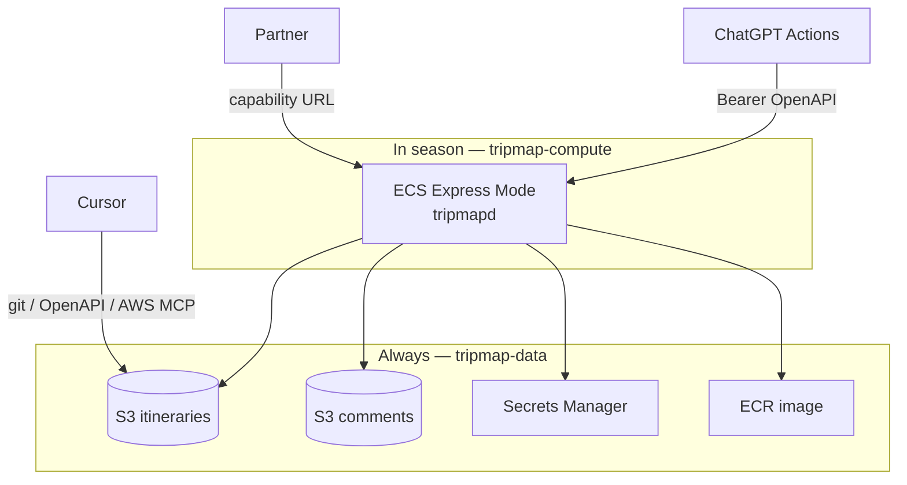

# AWS deployment plan

Authoritative plan for hosting tripmap **beyond** the current GitHub Pages static PWA.  
Companion: [itinerary-display-viewer.md](itinerary-display-viewer.md) (product/architecture), [itinerary-display-ux.md](itinerary-display-ux.md) (UI).

**Status:** Phase A live; Phase B agent API + write-through bundles implemented (capability-URL viewer is Phase C).  
**Current production (static):** GitHub Pages (`www.sheffer.org/tripmap/`).  
**In-season compute:** ECS Express Mode endpoint from `tripmap-compute` stack outputs.

---

## Locked decisions

| Topic | Decision |
|-------|----------|
| Edge CDN | **No CloudFront / WAF** in v1 |
| S3 encryption | **SSE-S3** (default); no SSE-KMS |
| Compute | **ECS Express Mode** (Fargate + managed ALB) — not App Runner (sunset / closed to many new accounts) |
| Scale to zero | **No** on Express Mode — instead **seasonal one-click deploy / undeploy** via CloudFormation |
| Infra as code | **CloudFormation** (two stacks). Agent maintains templates in-repo; you click Create/Delete stack (or one `aws cloudformation` command) |
| Viewer access | **Capability URL** (unguessable token in path) |
| Comments | Shared read/write for anyone with the URL; offline = read cache only |
| Custom tripmap MCP | **No** |
| Cursor | Repo + git; optional AWS MCP; optional same OpenAPI |
| ChatGPT | **Custom GPT + Actions (OpenAPI)**; Bearer encrypted in GPT editor |
| Agent API | OpenAPI on the container (`/openapi.yaml` + `/api/agent/*`) |
| Patch retries | **`Idempotency-Key` required** on mutating agent calls |
| Delete trip | **Omit** initially |
| Source of truth (live) | **S3** (persists across undeploys) |
| Schema evolution | **`schema_version`** in YAML |
| GitHub YAML | Cursor-maintained mirror under `itineraries/` |
| Region | **All tripmap resources in `eu-central-1` (Frankfurt)**. CLI default may stay `il-central-1`; always `--region eu-central-1` for tripmap |
| Public hostname (v1) | ALB / Express Mode default HTTPS URL. **May change on each redeploy** unless/until custom domain — update GPT Actions base URL + shared links after deploy (runbook) |

---

## Goals

| Requirement | Approach |
|-------------|----------|
| Run application code on AWS | **ECS Express Mode** when “in season” |
| Idle for months | **Delete compute stack** — keep data stack (~cents/mo) |
| One-click up/down | CloudFormation: `tripmap-data` (keep) + `tripmap-compute` (create/delete) |
| Canonical YAML | Versioned S3 |
| Comments | Unversioned S3 |
| ChatGPT | Actions → OpenAPI Bearer |
| Cursor / GH | Local YAML + git; publish/pull via OpenAPI |
| Viewer + comments | `/t/{id}/{token}/` on the live compute URL |
| Offline comments | Cached read-only |

### Non-goals (this plan)

- Custom MCP server
- CloudFront / WAF
- Terraform/CDK (CloudFormation only for v1)
- Always-on compute year-round
- App Runner as primary (deprecated path)
- Multi-tenant SaaS

---

## Seasonal deploy / undeploy

```text
Off-season (most of the year)
  ✅ tripmap-data stack: S3 ×2, Secrets, IAM roles, ECR (+ image)
  ❌ tripmap-compute stack: deleted → no ALB, no Fargate ≈ no ~$25/mo

Trip season (or a test weekend)
  ✅ Create tripmap-compute → Express Mode service from ECR image
  ✅ Note new HTTPS base URL → update Custom GPT Actions + partner links
  ✅ Smoke /health + one capability URL
```

| Action | How (one-click) |
|--------|------------------|
| **Deploy compute** | Console → CloudFormation → Create stack → upload `infra/compute.yaml` (or `aws cloudformation deploy --stack-name tripmap-compute ...`) |
| **Undeploy compute** | Console → stack `tripmap-compute` → **Delete** (or `aws cloudformation delete-stack`) |
| **Never delete** | Stack `tripmap-data` (unless retiring the project) |

Capability **tokens** stay in S3 meta across seasons. Only the **hostname** may change after a fresh compute stack — path `/t/{id}/{token}/` stays valid on the new host once bundles are served again (regenerate on first boot or via agent API).

---

## CloudFormation layout

Repo path (to add): `infra/`

| Template | Stack name | Lifecycle |
|----------|------------|-----------|
| `infra/data.yaml` | `tripmap-data` | **Persistent** — create once |
| `infra/compute.yaml` | `tripmap-compute` | **Ephemeral** — create/delete seasonally |

### `tripmap-data` (keep)

- S3 itineraries (versioning ON, Block Public Access)
- S3 comments (versioning OFF)
- Secrets Manager `tripmap/agent-bearer` (generate or pass as parameter — prefer generate-once and leave)
- ECR repository `tripmapd`
- IAM task/execution roles used by compute (or export role ARNs via stack outputs)
- Outputs: bucket names, secret ARN, ECR URI, role ARNs

### `tripmap-compute` (deploy/undeploy)

- ECS Express Mode service (or equivalent CFN resources Express Mode documents) pointing at ECR image tag (e.g. `latest` or immutable digest parameter)
- Env: bucket names, secret ARN, `AWS_REGION`, `PUBLIC_BASE_URL` (from stack output after create — or set in a second update), `OSRM_BASE_URL`, `MAX_YAML_BYTES`
- Health check `/health`
- Outputs: **`ServiceUrl`** (HTTPS base) — copy into GPT Actions + password manager

**Parameter:** `ImageTag` so redeploy can pin a digest without rebuilding the template.

Optional later: GitHub Actions `workflow_dispatch` jobs `deploy-compute` / `destroy-compute` that call CloudFormation — still one click from the Actions tab.

---

## Target architecture



When compute is deleted, GPT Actions and capability URLs are simply **offline** until the next deploy (expected off-season).

---

## Components

| Component | Stack | Responsibility |
|-----------|-------|----------------|
| **tripmapd container** | compute | Viewer, comments, OpenAPI, bundle regenerate |
| **S3 itineraries / comments** | data | Live data |
| **ECR** | data | Image kept between seasons |
| **Secrets Manager** | data | Agent Bearer |
| **Task role** | data (or compute) | S3 + secret access |
| **AWS MCP (optional)** | — | Cursor → S3 under your IAM |

### Request surface (when compute is up)

| Surface | Auth |
|---------|------|
| `GET /t/{id}/{token}/…` + comments API | Capability URL |
| `GET /health` | Public |
| `GET /openapi.yaml` | Public (spec) |
| `/api/agent/*` | Bearer |

---

## Data model

Unchanged in spirit:

- Versioned S3 YAML + `schema_version` + hashed capability token in `*.meta.json`
- Unversioned comments
- Write-through bundles when compute is running

Off-season: YAML/comments remain; bundles may be absent until next deploy regenerates them.

### Agent API (v1)

| Operation | Effect |
|-----------|--------|
| `GET/PUT .../trips/{id}/yaml` | Full YAML (**Idempotency-Key** on PUT) |
| `PATCH .../trips/{id}` | Structured patch |
| `POST .../trips` | Create + viewer URL |
| `GET .../schema` | Schema + version |
| `POST .../rotate-token` / `restore` | Token / S3 version ops |

---

## AuthN / AuthZ

- Capability URL for viewers/comments (shared edit).
- Agent Bearer in Secrets Manager + Custom GPT Actions.
- Cursor: git; publish via OpenAPI when compute is up.

### IAM (task role)

```text
s3: List/Get/Put itineraries; GetObjectVersion + ListBucketVersions
s3: List/Get/Put/Delete comments
secretsmanager:GetSecretValue on agent Bearer ARN
```

---

## Security (short)

Same threat model as before; add: **undeployed compute** means agent API is unreachable (good). Don’t leave an old ALB/DNS pointing at nothing without updating GPT — runbook step after delete.

---

## PWA

Capability-URL based; offline comment reads from cache; no queued writes. After redeploy with new host, users need the **new** full URL once (or custom domain later).

---

## Manual config work (agent-assisted)

Prefer **CloudFormation** over click-ops for buckets/roles/compute. You still approve stack creates in console (or run CLI). Agent authors/updates `infra/*.yaml` and provides exact commands.

### M1 — Account hygiene

- [x] Budget configured
- [ ] Region: work in **eu-central-1** for all tripmap stacks
- [ ] Optional: CLI default `il-central-1`; alias or always pass `--region eu-central-1`
- [ ] Skip App Runner gate — compute is Express Mode

### M2 — Data stack (once)

- [ ] Review `infra/data.yaml` (agent writes it)
- [ ] Create stack `tripmap-data` in eu-central-1
- [ ] Save stack **Outputs** (buckets, secret ARN, ECR)
- [ ] Confirm secret value in password manager; never commit

### M3 — First image

- [ ] `docker build` / `docker push` to ECR from Outputs
- [ ] Agent: exact commands with account/region/repo

### M4 — Compute stack (seasonal)

- [x] Create stack `tripmap-compute` with ImageTag + data stack exports
- [ ] Copy **ServiceUrl** output → password manager
- [x] `curl $ServiceUrl/health`
- [ ] **Undeploy drill:** delete `tripmap-compute`; confirm data stack intact; recreate; confirm new ServiceUrl

Agent API smoke (after image push):

```bash
ENDPOINT=$(aws cloudformation describe-stacks --stack-name tripmap-compute --region eu-central-1 \
  --query "Stacks[0].Outputs[?OutputKey=='Endpoint'].OutputValue" --output text)
TOKEN=$(aws secretsmanager get-secret-value --secret-id tripmap/agent-bearer --region eu-central-1 \
  --query SecretString --output text | jq -r .token)
BASE_URL="https://$ENDPOINT" TOKEN="$TOKEN" ./scripts/smoke-agent.sh
```

### M5 — Seed itineraries

- [ ] Upload YAML + meta (tokens); regenerate via agent API once compute is up
- [ ] Save capability URLs (host + token)

### M6 — Custom GPT

- [ ] Actions → `$ServiceUrl/openapi.yaml` + Bearer
- [ ] After every compute redeploy: update Actions **server URL** if host changed
- [ ] Agent: GPT instruction blurb + test prompts

### M7 — Cursor

- [ ] Rule/skill: publish/pull OpenAPI; seasonal “compute is down” awareness
- [ ] Optional AWS MCP for S3 inspection

### M8 — Cutover / Pages

- [ ] Share capability URLs when in season
- [ ] README: note seasonal hosting + link to runbook

### M9 — Runbooks (in-repo)

- [ ] `docs/runbook-deploy-compute.md` — one-click create + GPT URL update checklist
- [ ] `docs/runbook-undeploy-compute.md` — delete stack + “links offline until next season”

---

## Implementation phases

### Phase A — App + data template

- [x] `cmd/tripmapd` skeleton: health, Bearer middleware, static stub
- [x] `infra/data.yaml` + create `tripmap-data`
- [x] Push first ECR image

### Phase B — Compute template + OpenAPI

- [x] `infra/compute.yaml` (Express Mode)
- [x] OpenAPI agent API + schema_version + bundles
- [ ] Deploy/undeploy drill (M4)
- [ ] Seed + Custom GPT (M5–M6)

### Phase C — Comments + PWA

- [ ] Comments under capability URL; offline read-only

### Phase D — Ergonomics

- [ ] Runbooks M9; optional `workflow_dispatch` deploy/destroy
- [ ] Cursor skill

### Phase E — Hardening

- [ ] Token/Bearer rotation; restore version; Budget still green off-season

---

## Configuration (runtime, compute)

| Name | Source |
|------|--------|
| `AGENT_BEARER_TOKEN` | Secrets Manager (data stack) |
| `ITINERARIES_BUCKET` / `COMMENTS_BUCKET` | Data stack outputs |
| `AWS_REGION` | `eu-central-1` |
| `PUBLIC_BASE_URL` | Compute stack `ServiceUrl` |
| `OSRM_BASE_URL` / `MAX_YAML_BYTES` | Template parameters / defaults |

---

## Cost sketch

| State | Order of magnitude |
|-------|--------------------|
| **Off-season** (data only) | Cents–low $/mo |
| **In season** (Express Mode) | ~$25–40/mo while stack exists |
| CloudFormation | Free |

---

## Relation to existing roadmap

Live data in S3; ChatGPT via Actions; Cursor via git/OpenAPI. Compute is **ECS Express Mode**, stood up with **CloudFormation one-click** only when needed — avoids deprecated App Runner and avoids paying ALB/Fargate all year.

---

## Acceptance criteria

- [ ] `tripmap-data` survives compute delete; YAML/comments intact
- [ ] One-click (console or single CLI) create/delete of `tripmap-compute`
- [ ] In season: capability URL + shared comments + GPT Actions work
- [ ] Off season: no ALB/Fargate charges; GPT/links intentionally dead until redeploy
- [ ] After redeploy: runbook updates ServiceUrl in GPT Actions
- [ ] No custom MCP; no secrets in git; Budget on
- [ ] Manual checklist M1–M9 done once with agent help
