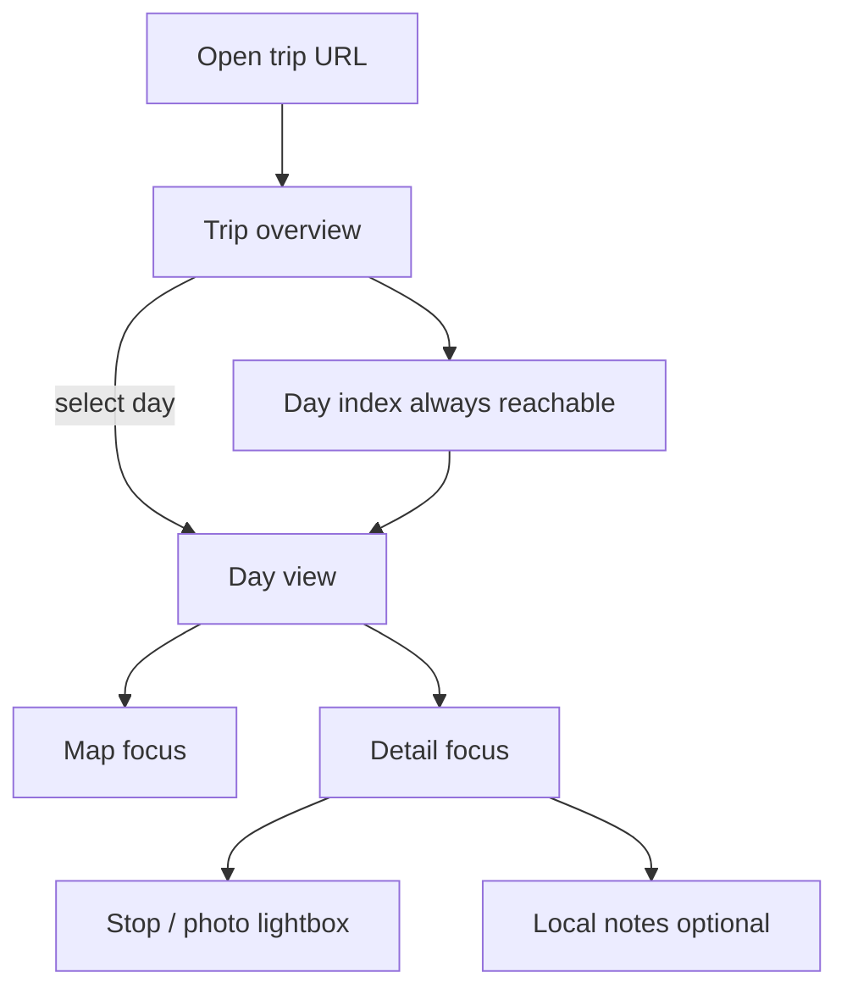

# Itinerary display — UI/UX plan

Visual and interaction design for the tripmap PWA viewer.  
Companion to [itinerary-display-viewer.md](itinerary-display-viewer.md).  
**Status:** MVP implemented (`--bundle` + `viewer/`). Further phases in architecture doc.

---

## Design goals

| Goal | Meaning |
|------|---------|
| **Glanceable** | On the road: which day am I on, where next, notes in a few taps |
| **Navigable** | 14–28 days: jump to any day without scrolling forever |
| **Map-first when needed** | Route is the product; text supports it, not the other way around |
| **Calm** | One job on screen; no control-panel clutter |
| **Shared** | Same layout for you and a read-only travel partner |
| **Dual form factor** | Laptop = map + detail side by side; phone = map or list focus, not both cramped |

Editing the itinerary (weather swaps, etc.) happens **outside** this UI (ChatGPT / API). The viewer is **read-only** for structure, with optional local notes.

---

## Design principles

1. **Trip name as identity** — The itinerary title (“Netherlands 2026”, “New Zealand 2026”) is the hero signal in chrome and the home-screen PWA name. Not buried as a nav subtitle.
2. **One job per surface** — Day index *or* map *or* stop detail dominates; avoid a dashboard of peer panels competing.
3. **Real place photographs over decoration** — Day/stop photos (when present) carry atmosphere. If no photo, use a quiet map crop or type-tint, not stock gradients.
4. **Route colors that match KML** — Drive blue, hike green, ferry orange — same semantics as Google Earth / My Maps so exports and the PWA feel like one product.
5. **Touch-first targets** — Day rows, stop chips, and map controls ≥ 44px; no hover-only critical actions.
6. **Offline honesty** — When basemap tiles fail, show route geometry clearly and a small “map tiles offline” note — not a broken-looking empty map.

### Explicitly avoid

- Generic “travel SaaS” look: purple/indigo gradients, glassy cards everywhere, pill cloud tags, multi-layer shadows.
- Dense “dashboard” chrome with stats bars and filter chips.
- Tiny side-panel maps on mobile that neither navigate nor read.
- Forcing dark mode as default (support system preference; default light for outdoor readability).

---

## Information architecture



### Content hierarchy (per day)

1. Day number + title  
2. Flags (hike / ferry) as quiet labels, not badges Galore  
3. Notes from YAML  
4. Photo (if any)  
5. Stops list (overnight, trailhead, attraction, …)  
6. Route on map  
7. Local notes (optional, secondary)

---

## Layouts

### Laptop / wide (≥ 900px)

Split canvas — **one composition**: map as the living plane, day list as navigation rail, detail as prose.

```
┌──────────────────────────────────────────────────────────┐
│ Trip title · date range · offline dot                     │
├──────────┬────────────────────────────┬───────────────────┤
│ Day      │                            │ Day 5             │
│ index    │         MAP                │ Tongariro …       │
│          │     (dominant)             │ notes · photo     │
│ Day 1    │                            │ stops             │
│ Day 2 ●  │                            │ local notes       │
│ …        │                            │                   │
└──────────┴────────────────────────────┴───────────────────┘
```

| Region | Width | Behavior |
|--------|-------|----------|
| Day index | ~220–260px | Sticky scroll; selected day highlighted; keyboard ↑↓ |
| Map | remaining center | Fit bounds on day change; pinch/zoom; show whole-trip briefly on first load optional |
| Detail | ~320–380px | Scroll independently; photo full-bleed within column |

**Keyboard:** `j` / `k` next/prev day; `/` focus day search when present.

### Phone / narrow (≤ 600px)

Stack with a **mode toggle** — never show three thin columns.

```
┌─────────────────────┐
│ Trip · Day 5 of 28  │
│ [ List ] [ Map ]    │   ← segmented control
├─────────────────────┤
│                     │
│  (List mode)        │
│  Title, notes,      │
│  photo, stops       │
│                     │
│  or (Map mode)      │
│  Full-bleed map     │
│  Bottom sheet peek: │
│  title + “Details”  │
└─────────────────────┘
```

| Pattern | Role |
|---------|------|
| **List mode** | Primary for notes / photos / stops while walking |
| **Map mode** | Full viewport map + peeking bottom sheet (title + flag) |
| **Bottom sheet** | Drag up for full day detail over the map; drag down to peek |
| **Day jump** | Top-of-screen “Day 5 · Tongariro” opens a full-screen day picker (sheet or modal) |

Tablets (~600–900px): prefer laptop layout at landscape; phone stack at portrait.

### Safe areas

- Respect `env(safe-area-inset-*)` for notch and Android gesture bars.
- Bottom sheet handle and segmented control clear of system gestures.

---

## Screens & flows

### 1. Trip overview (first paint)

**Purpose:** Orient — which trip, how long, where we are in the sequence.

- Trip title (large), short description, day count / night count if dates eventually exist.
- Optional hero from first day with a photo, else abstract map overview of all days (single muted polyline).
- CTA: **Today / Start** (day 1 or heuristically today if dates present later).
- Secondary: jump to day list.

Do not put booking status, weather, or stats on this first viewport.

### 2. Day index

**Desktop:** always-visible left rail.  
**Mobile:** full-screen picker via day chip in the header.

Each row:

```
Day 05 · Tongariro Alpine Crossing
         Hike · Mangatepopo → Ketetahi
```

- Number monospaced or tabular for alignment.
- Current day: left accent bar in route-type color (blue drive / green hike / orange ferry) or overnight gray if rest day.
- Long titles truncate with ellipsis; full title in `title` attribute / spoken on focus.
- Optional tiny thumbnail if day has `photo`.
- Search filter on 20+ days (debounced text filter on title + stop names).

### 3. Day view — detail

- Heading: `Day 5` micro-label + title display.
- Flag chips only if true: `Hike`, `Ferry` — plain text labels with color, not pill clusters of icons.
- Notes as readable paragraph.
- Photo: edge-to-edge in the detail column (desktop) / full width (mobile); tap → lightbox.
- Stops: ordered list, not cards-in-cards. Each row = type icon + name; secondary line = type label. Tap row → focus stop on map + optional expand notes.
- Local notes: collapsed “Your notes” disclosure at bottom; autosave to `localStorage`.

### 4. Map

| Feature | Spec |
|---------|------|
| Style | Light OSM/Carto basemap; quiet; route lines are the color accent |
| Route | Selected day bold; other days optional faint “trail of the trip” when “Show all days” on |
| Markers | Type-based icons (reuse tripmap types: overnight, hut, trailhead, attraction, viewpoint, ferry, airport) — limited palette |
| Selection | Fit selected day with padding; don't animate bounce |
| Offline | Lines + markers remain; basemap may grey out with banner |
| Whole-trip | Toggle in map toolbar: “This day / Full trip” |

Avoid floating badges on the map (distance chips, ETA stickers) until distance/time exists in data.

### 5. Photo lightbox

- Dark overlay, centered image, pinch-zoom on mobile.
- Caption = stop or day name.
- Close: backdrop tap, Esc, swipe down on mobile.

### 6. Empty / edge states

| State | UI |
|-------|-----|
| Rest day, no route | Detail full; map shows overnight point only |
| No photo | Skip image block; don’t use a placeholder mountain illustration |
| Load error | Trip-level message: “Couldn’t load trip.json” + retry |
| Offline tiles | Banner; geometry still drawn |

---

## Visual language

### Direction

**“Field notebook + survey map”** — clear type, paperlike light surfaces, map as the outdoor vista. Not a SaaS marketing page; not dark fantasy travel.

### Color (CSS variables)

| Token | Role | Suggestion |
|-------|------|------------|
| `--ink` | Body text | Near-black ink `#1a1f1c` |
| `--paper` | Page / panels | Warm off-white `#f3efe6` with subtle noise or soft radial wash — not flat gray-white only |
| `--map-panel` | Behind map chrome | Slightly cooler paper `#ebe8e1` |
| `--drive` | Drive routes | Blue matching KML intent `#2563eb` (or tuned to existing KML blue) |
| `--hike` | Hike | Forest green `#2f7d4a` |
| `--ferry` | Ferry | Amber `#c45e14` |
| `--accent` | Selection / links | Deep teal `#0f5c5c` — distinct from purple SaaS defaults |
| `--muted` | Secondary text | `#5c635c` |

Icons for stop types: monochrome ink + small type color tip, not neon rainbow.

### Typography

| Role | Guidance |
|------|----------|
| Trip title / day title / place names | Expressive **display** face for atmosphere — **not** Inter / Roboto / bare `system-ui` as the brand. |
| Body / notes | Readable **text** face with good small sizes. |
| Day numbers, coordinates (if shown) | Tabular / mono for scanability. |

**Unicode coverage (required):** Place names regularly use Latin Extended characters (e.g. **Wānaka**, **Kröller-Müller**, Dutch **ij**, macron vowels common in Māori). Fonts chosen for titles and stop names must cover **Latin Extended-A/B** (and preferably Latin Extended Additional for combining marks). Verify in the UI with a checklist of real itinerary strings before shipping.

| Prefer | Avoid for place names |
|--------|------------------------|
| Familes with documented / tested Latin Extended coverage (e.g. **Source Serif 4**, **Source Sans 3**, **Noto Serif / Noto Sans**, **Literata**, **IBM Plex Serif**) | Display faces that only ship basic Latin glyphs (tofu/`?` boxes for ā, ö, ō) |
| Self-host a subset that still includes needed code points, **or** load from Google Fonts with subsetting that keeps Extended Latin | Relying on “pretty” fonts that look fine in English demos only |

**Stack:** always put a **Unicode-strong** family first for place-name slots, then a known-good fallback (`"Noto Serif", "Source Serif 4", Georgia, serif` or the Sans equivalent). Do **not** put a narrow ornamental face alone without that fallback.

**Bundling:** Prefer self-hosting WOFF2 in the trip bundle so offline PWAs still render ā/ö correctly even when Google Fonts is unreachable.

Scale (approx):

- Trip title: clamp 1.75rem–2.5rem  
- Day title: 1.35–1.6rem  
- Body: 1rem / 1.55 line-height  
- Meta: 0.875rem

**Acceptance check:** Day list and stop labels show Wānaka / Kröller-Müller / Afsluitdijk without missing glyphs on Chrome (desktop), Chrome Android, and Safari iOS.
### Shape & density

- Prefer **flat regions and hairline divides** over card stacks.
- Detail/stop rows: spacing + type hierarchy; thin rules between stops OK.
- Corners: modest (4–8px) if any radius; avoid fully rounded pills for everything.
- Map controls: square/soft-square buttons, large enough for thumbs.

### Motion (2–3 intentional)

1. **Day change** — brief crossfade of detail content (150–200ms); map fitBounds smooth.
2. **Bottom sheet** — spring or ease on drag (mobile).
3. **Lightbox** — fade in/out only; no bounce.

Reduce motion when `prefers-reduced-motion: reduce`.

---

## Component inventory

| Component | Desktop | Mobile |
|-----------|---------|--------|
| App chrome (title, offline, install) | Top bar | Compact top bar |
| Day index rail | Always on | Full-screen picker |
| Segmented List / Map | Hidden | Primary |
| Map viewport | Center pane | Full in Map mode |
| Day detail panel | Right pane | List mode body / sheet |
| Stop row | In panel | In panel |
| Photo strip / hero | In panel | In panel |
| Local notes | Disclosure | Disclosure |
| Offline banner | Top of map | Top of map |
| Lightbox | Overlay | Overlay |

---

## Responsive breakpoints

| Name | Width | Layout |
|------|-------|--------|
| `phone` | &lt; 600px | Stack + List/Map toggle |
| `tablet` | 600–899px | Stack portrait; optional split landscape if width ≥ 800 |
| `desktop` | ≥ 900px | Three-region split |

---

## Accessibility

- Map is not the only way to understand the day — stops and notes remain text.
- Focus order: chrome → day index → detail → map controls.
- Markers/toggles announce state to screen readers.
- Color not sole cue for hike vs drive (include text label).
- Contrast on paper/ink ≥ WCAG AA.
- Capture Esc: close lightbox / sheet first, then clear selection.

---

## Performance & perceived speed

- Show day index + titles from `trip.json` immediately; load `geo/day-N.json` for selected day on demand (prefetch neighbors).
- Photos lazy-load; blurhash or soft color wash optional later — not required for MVP.
- Bundle keeps Leaflet lean; no animation libraries unless needed for sheet.

---

## Content rules for authors (YAML → UI)

| Author does | UI consequence |
|-------------|----------------|
| Meaningful `title` | Day list scanability |
| Short `notes` | Fits detail without walls of text |
| `photo` on key days | Atmosphere; skip decorative filler |
| Correct stop `type` | Correct icon + semantics |
| Pre-encode weather backups in notes | Readable in detail; API later |

---

## Phased UX delivery

| Phase | UX milestone |
|-------|----------------|
| 2 | Desktop split + phone stack; day jump; map + stops |
| 3 | Photos + lightbox |
| 4 | Offline banner; geometry-without-tiles behavior |
| 5 | Installable PWA (manifest, home-screen icon from trip photo or monogram) |
| 9 | Local notes disclosure |

Skip polish that pretends editing lives in the UI until the API path is real.

---

## Out of scope for UI

- Drag-and-drop day reordering in the viewer  
- In-map drawing / routing  
- Shared realtime cursors  
- Dark-first theming as product identity  

---

## Review checklist

- [ ] First open: trip title readable; path to Day 1 obvious  
- [ ] 28-day trip: can open Day 24 in under 3 taps/clicks  
- [ ] Phone: List and Map modes each usable one-handed  
- [ ] Outdoor: light theme readable in sun; offline state clear  
- [ ] Partner on shared link: no edit chrome, no API key UI  
- [ ] Place names with ā / ö / ō (Wānaka, Kröller-Müller) render without missing glyphs offline and online 
---

## Related

- Architecture & state: [itinerary-display-viewer.md](itinerary-display-viewer.md)
- Product checklist: [TODO.md](../TODO.md)
