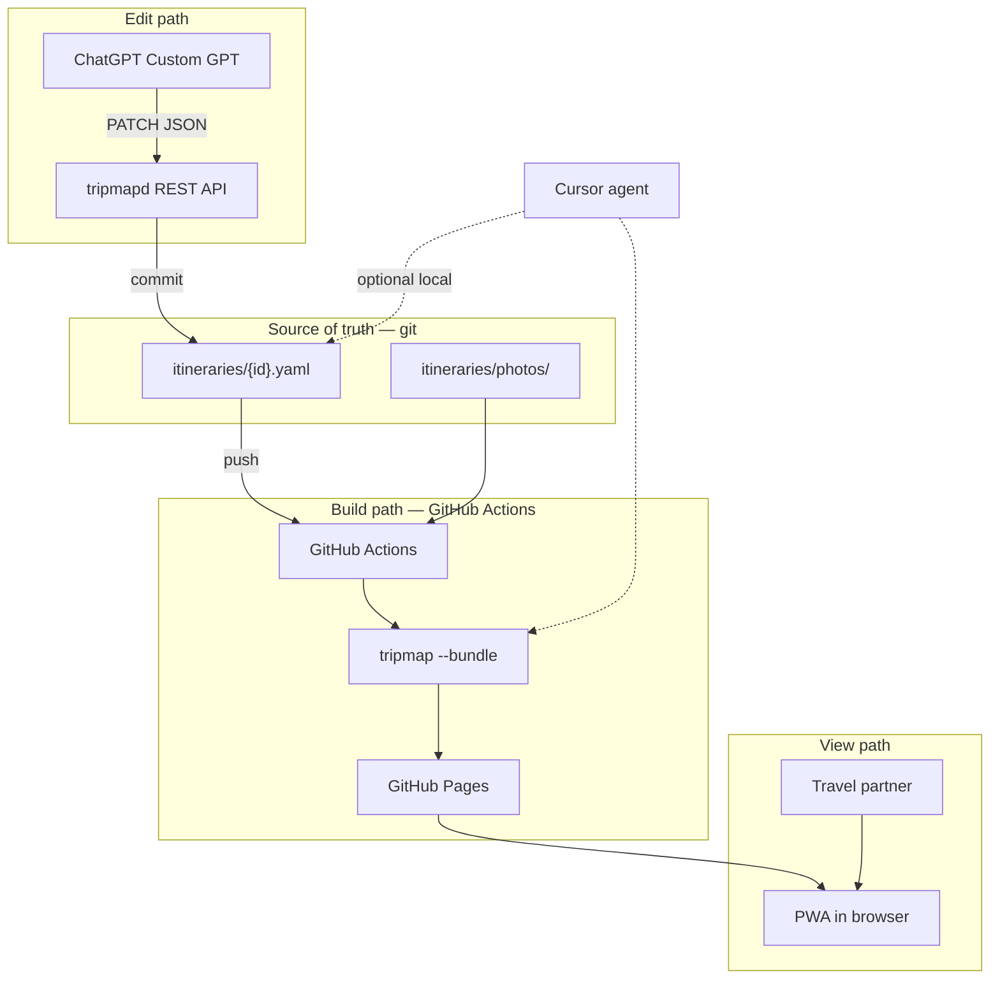

# Itinerary display plan

Plan for viewing and editing tripmap itineraries on mobile and laptop.  
**Status:** draft for review — not yet implemented.

UI/UX (layouts, visual language, mobile patterns): [itinerary-display-ux.md](itinerary-display-ux.md).

---

## Goals

| Goal | Approach |
|------|----------|
| View multi-day trips with day navigation | Static PWA generated from YAML |
| Offline on the road | Service worker caches bundle (data + photos); map tiles online-only at first |
| Share with travel partner (read-only) | Stable GitHub Pages URL per trip |
| Mid-trip changes (weather, swaps) | ChatGPT → REST API → YAML in git → Actions redeploy |
| Photos | Optional `photo:` in YAML, copied into bundle |
| Minimal ad-hoc notes | Optional `localStorage` comments in PWA (device-local) |

## Non-goals (for now)

- In-PWA itinerary editor
- `overrides.json` or any second state layer beside YAML
- Real-time multi-user collaboration
- Manual YAML editing as the primary workflow
- Offline map tiles (phase 2 at earliest)
- Full trip-planning engine (auto-routing by preferences, etc.)

---

## Context

[tripmap](../README.md) today is a Go CLI: YAML in → KML out.

- Rich day/stop schema in [`itineraries/`](../itineraries/)
- Map geometry via OSRM ([`routing/osrm.go`](../routing/osrm.go))
- My Maps output (`--mymaps`), Google Earth KML

**Gaps:** no structured viewer, no offline bundle, no photos in YAML, weak mobile day navigation, no remote edit path for ChatGPT.

---

## Requirements matrix

| Requirement | Static PWA + API | KML + My Maps | Cursor skill only |
|-------------|------------------|---------------|-------------------|
| Offline viewing | Strong (cached bundle) | Weak | Strong (local bundle) |
| Android + laptop | PWA | My Maps app | Local file / Pages |
| Day navigation | Built-in index | Flat placemark list | Same as PWA |
| Mid-trip structural changes | REST API → git → Actions | Re-import KML manually | Patch YAML locally |
| ChatGPT on phone | Custom GPT Actions | Awkward | Not available |
| Read-only share | Pages URL | My Maps link | Zip / Pages |
| Pictures from YAML | Bundled | Manual | Bundled |
| Build effort | Medium–high | Low (exists) | Low–medium |

---

## Recommended architecture

Two deployables, one source of truth:



### Components

| Component | Role | Stateful? |
|-----------|------|-----------|
| `itineraries/*.yaml` | Canonical itinerary | Yes — in git |
| `itineraries/photos/` | Image assets referenced by YAML | Yes — in git |
| `tripmap --bundle` | YAML → `trip.json` + geo + images + viewer shell | Stateless CLI |
| GitHub Pages bundle | What the PWA reads | Derived — rebuilt from YAML |
| `tripmapd` API | Accept patches, commit YAML | Stateless (git is storage) |
| GitHub Actions | Test, bundle, deploy | Stateless CI |
| PWA `localStorage` | Ephemeral comments per device | Local only |

---

## State management

### Where data lives after a change

| Layer | Location | Mutable by | Survives redeploy? |
|-------|----------|------------|-------------------|
| **Itinerary (truth)** | `itineraries/{id}.yaml` on GitHub `main` | API `PATCH`, Cursor skill, direct commit | Yes — git history |
| **Photos** | `itineraries/photos/` in git (or remote URLs in YAML) | Same as YAML | Yes |
| **Bundle** | GitHub Pages (`gh-pages` or `/docs` artifact) | Only via Actions rebuild | Replaced each deploy |
| **KML** (optional) | `maps/*.kml` local/gitignored | `tripmap` CLI | Separate output; not used by PWA |
| **PWA comments** | Browser `localStorage` | User in viewer | No — per device |
| **API process** | Container memory | — | Nothing persisted |

**Rule:** If YAML and bundle disagree, **YAML wins**. Bundle is always regenerable:

```bash
go run . --input itineraries/nz-4weeks.yaml \
  --bundle maps/nz-4weeks-bundle/ --route osrm --mymaps
```

### Change lifecycle (weather swap example)

1. **Before:** `itineraries/nz-4weeks.yaml` on `main` at commit `abc123`; Pages serves bundle built from `abc123`.
2. **PATCH:** ChatGPT sends `{ "swap_days": [5, 12], ... }` → API validates, writes new YAML, commits `def456` to `main`.
3. **Build:** Actions triggered by push → `go test` → bundle → deploy to Pages.
4. **After:** Pages serves bundle from `def456`. PWA offline cache shows old bundle until user refreshes (or SW updates).

### Commit policy (proposed)

| Policy | When | Trade-off |
|--------|------|-----------|
| **Direct to `main`** | Default for personal repo | Fastest for weather swaps; no review step |
| **PR per change** | Optional flag on API | Safer; slower on the road |

Recommendation: **direct to `main`** with descriptive commit messages (`tripmap: swap days 5↔12 weather backup`).

### Concurrency

- API uses GitHub Contents API with file **SHA** for optimistic locking.
- If two PATCHes race, second fails with conflict → ChatGPT retries after `GET`.
- Acceptable for one editor + one partner viewing.

### Versioning and rollback

- Full history in `git log -- itineraries/nz-4weeks.yaml`.
- Rollback: `git revert` or API `PATCH` restoring prior content → Actions redeploys.
- No separate version table or database.

### Trip identity

- Trip ID = YAML filename without extension: `nz-4weeks`, `holland`.
- API path: `/trips/nz-4weeks` ↔ `itineraries/nz-4weeks.yaml`.
- Pages URL (proposed): `https://yaronf.github.io/tripmap/trips/nz-4weeks/` (one bundle per trip).

---

## PWA bundle (`tripmap --bundle`)

### Output layout

```
maps/nz-4weeks-bundle/          # gitignored locally; deployed to Pages
  index.html                    # copied from viewer/
  app.js, style.css, sw.js, manifest.json
  trip.json                     # trip metadata + days + stops (no heavy geometry)
  geo/
    day-01.json                 # GeoJSON Feature per day (routes + markers)
    day-02.json
    ...
  images/                       # copied from itineraries/photos/ references
    kepler-hut.jpg
```

### `trip.json` shape (sketch)

```json
{
  "id": "nz-4weeks",
  "title": "New Zealand 2026",
  "description": "Four-week road trip starting 22 Nov 2026",
  "days": [
    {
      "day": 5,
      "title": "Tongariro Alpine Crossing",
      "notes": "Weather backup day if necessary.",
      "hike": true,
      "photo": "images/tongariro.jpg",
      "stops": [
        { "name": "Mangatepopo Trailhead", "type": "trailhead", "lat": -39.1445, "lon": 175.5811 }
      ],
      "geo": "geo/day-05.json"
    }
  ]
}
```

### Viewer UI

- **Day index** — sidebar (desktop) / drawer (Android); jump to day 1–N; search by title
- **Map** — Leaflet; selected day route + markers; fit bounds on day change
- **Detail** — title, notes, stop list with type icons (match [`kml.go`](../kml.go) types)
- **Photos** — day hero + stop thumbnails; lightbox on tap
- **Comments** (optional) — textarea per day; `localStorage` only; not synced unless user exports manually

### Offline

- Service worker precaches: shell, `trip.json`, `geo/*.json`, `images/*`
- Map tiles: fetch from OSM/Carto online; if offline, show geometry-only map (no basemap)
- “Add to Home Screen” on Android

### Sharing

- Deploy bundle to GitHub Pages; send partner the URL.
- Partner does not need API key; read-only by default.

---

## REST API (`cmd/tripmapd`)

### Why

ChatGPT (web/mobile) cannot access your filesystem. Custom GPT **Actions** need HTTPS + OpenAPI. A small API is the clean boundary.

### Endpoints

| Method | Path | Auth | Purpose |
|--------|------|------|---------|
| `GET` | `/health` | No | Liveness |
| `GET` | `/trips` | API key | List trip IDs |
| `GET` | `/trips/{id}` | API key | Current trip JSON (from YAML, not bundle) |
| `PATCH` | `/trips/{id}` | API key | Apply structured changes; commit to git |
| `GET` | `/openapi.yaml` | No | OpenAPI 3 spec for Custom GPT |

`POST /regenerate` is **not** needed if every commit triggers Actions.

### PATCH operations (initial set)

ChatGPT maps natural language → JSON body:

```json
{
  "swap_days": [5, 12],
  "days": {
    "5": {
      "title": "Rest day (was Tongariro)",
      "notes": "Moved to day 12 due to weather."
    },
    "12": {
      "title": "Tongariro Alpine Crossing",
      "hike": true
    }
  }
}
```

| Operation | JSON field | Example |
|-----------|------------|---------|
| Swap two days | `swap_days: [a, b]` | Weather backup |
| Update day fields | `days.{n}.title`, `.notes`, `.hike`, `.ferry` | Rename, annotate |
| Replace route | `days.{n}.route: [...]` | Skip a stop, new driving line |
| Replace stops | `days.{n}.stops: [...]` | Add attraction |
| Insert day | `insert_day: { after: 4, day: {...} }` | Extra rest day |
| Delete day | `delete_day: 19` | Cancel a day |

API validates: required coords, known types, day numbers in range. Returns `{ "commit": "def456", "message": "..." }`.

### Implementation notes

- Go HTTP server in same module; reuse `Trip`, `Day`, `Stop` structs from [`kml.go`](../kml.go).
- Git write via **GitHub Contents API** (no local clone required) or git2go with deploy key.
- Env vars: `GITHUB_TOKEN`, `GITHUB_REPO`, `API_KEY`, `GIT_BRANCH=main`.

### Hosting

| Option | Pros | Cons |
|--------|------|------|
| **Fly.io** | Simple Docker deploy, scale-to-zero | Small cost |
| **Cloud Run** | GCP free tier | Slightly more setup |
| **Railway** | Easy | Cost |

Deploy API container via GitHub Actions on tag or `main` changes to `cmd/tripmapd/`.

### Auth

- Single shared **API key** header: `Authorization: Bearer <key>`.
- Stored in ChatGPT Custom GPT Action config and Fly/Railway secrets.
- Repo is private or public; API key prevents unauthorized PATCHes either way.

---

## GitHub Actions

### Workflow: `deploy-trip.yml` (on push to `main`)

```yaml
# Sketch — not final
on:
  push:
    branches: [main]
    paths: ['itineraries/**', 'kml.go', 'bundle.go', 'viewer/**', 'main.go']

jobs:
  build-deploy:
    runs-on: ubuntu-latest
    steps:
      - uses: actions/checkout@v4
      - uses: actions/setup-go@v5
      - run: go test ./...
      - name: Bundle changed trips
        run: |
          for f in itineraries/*.yaml; do
            id=$(basename "$f" .yaml)
            go run . --input "$f" --bundle "pages/trips/$id/" --route osrm --mymaps
          done
      - name: Deploy to GitHub Pages
        uses: actions/upload-pages-artifact@v3
        # + deploy-pages job
```

### Workflow: `deploy-api.yml` (optional, on `cmd/tripmapd/**` changes)

Build Docker image → push to registry → deploy Fly.io.

### OSRM in CI

- Use public OSRM demo server with rate-limit awareness, or
- Cache route geometry in `geo/` committed to a build artifact (not git) — revisit if CI is flaky.

---

## ChatGPT integration

### Custom GPT setup (manual, one-time)

1. Create Custom GPT with instructions: “You edit tripmap itineraries via the tripmap API. Always GET before PATCH. Translate user requests into PATCH JSON.”
2. Add Action: import `https://<api-host>/openapi.yaml`.
3. Configure API key authentication.
4. Test: “What’s on day 5 of nz-4weeks?” → `GET /trips/nz-4weeks`. “Swap days 5 and 12” → `PATCH`.

### Cursor skill (optional, local)

- Skill reads [`README.md`](../README.md) schema + this doc.
- Patches `itineraries/*.yaml` directly; runs `go test` and `tripmap --bundle`.
- Same PATCH semantics as API for consistency.
- Use for pre-trip planning; API for on-the-road ChatGPT.

---

## Schema extensions

### Photos (phase 3)

```yaml
days:
  - day: 9
    title: Hoge Veluwe + Kröller-Müller
    photo: photos/kroller-muller.jpg
    route:
      - { name: Otterlo, type: overnight, lat: 52.0997, lon: 5.7739 }
    stops:
      - name: Kröller-Müller Museum
        type: attraction
        lat: 52.0942
        lon: 5.8172
        photo: photos/km-museum.jpg
```

- Paths relative to itinerary file directory.
- Remote `https://` URLs allowed; bundle step may cache for offline.

### Weather backup hints (optional, in YAML)

```yaml
  - day: 5
    title: Tongariro Alpine Crossing
    hike: true
    notes: Weather backup day if necessary.
    swap_with: 12
```

Surfaced in PWA detail panel and `GET /trips/{id}`; `swap_days` PATCH uses this as a hint for ChatGPT.

---

## Repository layout (after implementation)

```
tripmap/
  itineraries/
    holland.yaml
    nz-4weeks.yaml
    photos/              # optional shared photos
  viewer/                # PWA source (committed)
    index.html
    app.js
    style.css
    sw.js
    manifest.json
  cmd/
    tripmapd/            # REST API
      main.go
  bundle.go              # --bundle export
  openapi.yaml           # API spec for Custom GPT
  .github/workflows/
    deploy-trip.yml
    deploy-api.yml
  maps/                  # gitignored local output
  docs/
    itinerary-display-viewer.md   # this file
```

---

## Implementation phases

| Phase | Deliverable | Depends on |
|-------|-------------|------------|
| **1** | `trip.json` + per-day GeoJSON export; `--bundle` flag; tests | — |
| **2** | `viewer/` SPA: day index, map, detail panel | 1 |
| **3** | Photo field in YAML + bundle copy + lightbox | 1, 2 |
| **4** | Service worker; offline shell + data + images | 2 |
| **5** | GitHub Actions → GitHub Pages | 1, 2 |
| **6** | `tripmapd` API + OpenAPI + PATCH + git commit | 1 |
| **7** | Custom GPT Action wired to API | 6 |
| **8** | Cursor skill (optional) | 1, 6 |
| **9** | Ephemeral PWA comments (`localStorage`) | 2 |

**MVP milestone:** phases 1–2 — local bundle, open `index.html`, day list + map.  
**Share milestone:** phase 5 — stable Pages URL.  
**ChatGPT milestone:** phases 6–7 — PATCH from phone, auto-redeploy.

---

## Alternatives considered

### A. KML + Google My Maps

Keep `--mymaps` as map-only share fallback. Poor offline, no day index, no API path.

### B. `overrides.json` layer

Rejected — awkward merge semantics; YAML + git history is simpler.

### C. Cursor skill only (no API)

Insufficient for ChatGPT-on-phone; keep as optional local path.

### D. Full hosted app (Firebase, etc.)

Overkill for personal trips; revisit only for live multi-user editing.

---

## Open decisions (for review)

| # | Question | Proposal |
|---|----------|----------|
| 1 | Commit policy | Direct to `main` |
| 2 | Pages URL structure | `/trips/{id}/` per itinerary |
| 3 | API host | Fly.io scale-to-zero |
| 4 | OSRM in CI | Public demo server initially |
| 5 | Map library | Leaflet (simpler than MapLibre for MVP) |
| 6 | Private vs public repo | Public repo OK; API key protects writes |
| 7 | KML generation | Keep CLI `--output` separate; PWA does not replace KML/Earth |

---

## Recommendation

Build **static PWA + git-backed YAML + REST API + GitHub Actions**:

1. Phases 1–2 locally (bundle + viewer).
2. Phase 5 for partner sharing via Pages.
3. Phases 6–7 for ChatGPT mid-trip edits.

Keep **My Maps** and **Google Earth KML** as secondary export formats.

### Commands (target state)

```bash
# Local development
go run . --input itineraries/holland.yaml --bundle maps/holland-bundle/ --route osrm --mymaps

# Production: push YAML or PATCH via API → Actions deploys automatically
# View: https://<user>.github.io/tripmap/trips/holland/
```

### Success criteria

- [ ] 28-day NZ trip navigable by day on Android PWA
- [ ] Works offline after one online visit (except map tiles)
- [ ] Partner opens same URL, sees current plan
- [ ] “Swap day 5 and 12” via ChatGPT updates YAML and redeploys within ~2 minutes
- [ ] `git log` shows every mid-trip change with clear messages

---

## Related docs

- [README.md](../README.md) — current CLI and YAML schema
- [TODO.md](../TODO.md) — implementation checklist
