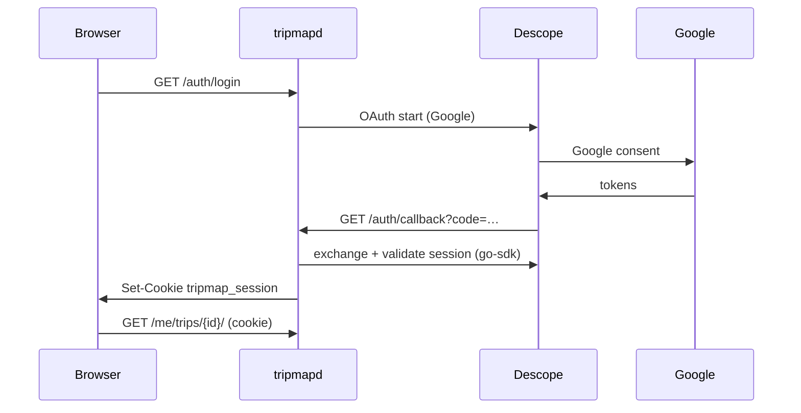

# Plan: Hellō → Descope (Google only, Option A)

**Status:** **In progress — console setup.** Google OAuth branding is **verified and published**. Finish Descope + Google client wiring (§3–4), then re-land Option A code and deploy.  
**Baseline tag:** `pre-descope` (Hellō + legal/home UI; Descope auth code not in tree).  
**Scope:** Replace Hellō with Descope social login (Google only). Keep the existing `tripmap_session` HMAC cookie and `/me/trips/{id}/` viewer path unchanged.

---

## 0. Pause notes (2026-08-22)

We drafted Option A, deployed `/privacy` and `/terms` + a purpose-first home page for Google branding, then temporarily reverted Descope code and stayed on Hellō while branding was stuck.

**What changed later the same day:** Google brand verification **passed after waiting a few hours** and retrying; the app was **published** to Production. The earlier “homepage purpose / app name mismatch” flags were a delayed automated crawl, not a permanent block. Dual Test-users ACL is **not** required once Production branding is verified.

**Still true / keep:**

- Public home + `/privacy` + `/terms` (needed for Google Branding; keep on Hellō until cutover).
- Prefer **Production** External + verified branding over Testing (avoids a second Google test-user list).
- Git tag `pre-descope` marks the Hellō restore point before Descope code returns.

**Next:** complete Descope Google provider + redirect URLs (§3), paste client into Descope, then re-implement/deploy Option A and smoke login.

---

## 1. Target architecture




**Unchanged after login:** `sessionFromRequest`, `users.csv` ACL, notes, chat, bundles, agent Bearer API.

---

## 2. Decisions (locked)


| #   | Decision                    | Choice                                                                                                                                                                            |
| --- | --------------------------- | --------------------------------------------------------------------------------------------------------------------------------------------------------------------------------- |
| D1  | Auth adapter                | Option A — Descope at login only; keep `tripmap_session`                                                                                                                          |
| D2  | Providers                   | Google only                                                                                                                                                                       |
| D3  | Login UX                    | Server redirect only; no Descope JS in viewer PWA                                                                                                                                 |
| D4  | Routes                      | `/auth/login`, `/auth/callback`, `/auth/me`, `/auth/logout`; remove `/auth/hello/*`                                                                                               |
| D5  | Callback URL                | `https://tripmap.sheffer.org/auth/callback`                                                                                                                                       |
| D6  | Session cookie              | Keep `tripmap_session`                                                                                                                                                            |
| D7  | Session secret              | `SESSION_SECRET` env; SM secret `tripmap/session` (migrate value from `hello-session` once)                                                                                       |
| D8  | Session TTL                 | 7 days                                                                                                                                                                            |
| D9  | Allowlist                   | `users.csv` by **email only** — `sub` column unused in v1                                                                                                                         |
| D10 | Chat ACL                    | `chat=yes` in CSV                                                                                                                                                                 |
| D11 | Cutover                     | Big-bang; all users re-login once                                                                                                                                                 |
| D12 | Descope region              | **US** (Free Forever default — no region picker). EU only via [support](mailto:support@descope.com) or paid plan (§3.0). Itinerary data stays in AWS **eu-central-1** either way. |
| D13 | Google OAuth mode           | **Production** (see §2.1)                                                                                                                                                         |
| D14 | OAuth CNAME / custom domain | **No** — Free tier; use Descope default OAuth callback (§4)                                                                                                                       |
| D15 | Hellō teardown              | Remove after successful prod smoke                                                                                                                                                |


### 2.1 D13 — “Production” consent: for users, not you

Two different “consents” — easy to conflate:


| What                                             | Who                                                | Purpose                                                                                                                                            |
| ------------------------------------------------ | -------------------------------------------------- | -------------------------------------------------------------------------------------------------------------------------------------------------- |
| **OAuth consent screen (Testing vs Production)** | **Your travelers** who click “Sign in with Google” | Testing = only accounts you manually add as “test users” in GCP (max 100). **Production** = any Google account can complete the Google OAuth step. |
| **Developer contact / support email**            | **You** (GCP project owner)                        | Google reaches you about the project; not an end-user step.                                                                                        |


**What we want:** Production — friends/family sign in with their normal Google accounts without being listed as GCP test users.

**What still protects tripmap:** `users.csv` email allowlist after Descope returns identity. Unknown Google accounts get 403 *after* Google OAuth, same as today with Hellō.

**Scopes** (`openid`, `email`, `profile`) are non-sensitive; full Google verification is unlikely for this app size. Consent screen app name: **Tripmap**.

---

## 3. External accounts (you register)

### 3.0 Descope region (Free tier — no “EU” toggle)

There is **no region setting in Project Settings**. Region is chosen **only when creating a project** — and on **Free Forever** you usually **don’t get a choice**.


| Plan                | Region picker at **+ Project**?             | Default  |
| ------------------- | ------------------------------------------- | -------- |
| **Free Forever**    | **No** — new projects are **US** (Virginia) | US       |
| Growth / Enterprise | Yes — US / EU / AU / CA                     | You pick |


**If you want EU (Frankfurt) on Free:** email [support@descope.com](mailto:support@descope.com) and ask them to create or move you to an EU project. Otherwise **use the US project you already have** — recommended for v1.

**How to check which region a project uses** (after creation):

- **Project Settings** → Federated / OIDC issuer URL, or regional API host docs:
  - US: `https://api.descope.com`
  - EU: `https://api.euc1.descope.com`
- Google redirect URI on the Google provider page should match that host (e.g. `https://api.descope.com/v1/oauth/callback` for US).

**tripmapd:** pass only `DESCOPE_PROJECT_ID`. The Go SDK resolves the correct regional API host from the project ID ([Descope docs](https://docs.descope.com/management/project-settings/multi-regional)). No `DESCOPE_BASE_URL` unless you later use a custom domain or private cloud.

**Data residency split (acceptable for family tripmap):**


| Data                                     | Location                                        |
| ---------------------------------------- | ----------------------------------------------- |
| Itineraries, comments, bundles           | AWS **eu-central-1** (unchanged)                |
| Descope auth (email, name, login events) | **US** on Free tier unless support gives you EU |


### 3.1 Descope — what to copy where

**OAuth login only needs the Project ID on tripmap.** Google client id/secret live in Descope, not in tripmapd.


| Value                             | Example shape                                                              | Save in (tripmap)                                                                                            | Save in (Descope console)                                                                                             | Save in (Google Cloud)                                            |
| --------------------------------- | -------------------------------------------------------------------------- | ------------------------------------------------------------------------------------------------------------ | --------------------------------------------------------------------------------------------------------------------- | ----------------------------------------------------------------- |
| **Project ID**                    | `P2xxxxxxxxxxxxxxxxxxxx`                                                   | `.env` → `DESCOPE_PROJECT_ID=…`; deploy → `export DESCOPE_PROJECT_ID=…` before `./scripts/deploy-compute.sh` | Home → your project (top bar / Project Settings) — **copy only, nothing to paste**                                    | —                                                                 |
| **Management Key**                | `K2xxxxxxxx…`                                                              | **Not used** in v1 (no admin APIs) — optional in password manager                                            | Company → Access Keys — **ignore for now**                                                                            | —                                                                 |
| **Google Client ID**              | `123….apps.googleusercontent.com`                                          | **Do not put in tripmap**                                                                                    | Authentication → Social → Google → **Use my own account** → Client ID                                                 | Credentials → OAuth client → you create & copy from here          |
| **Google Client secret**          | `GOCSPX-…`                                                                 | **Do not put in tripmap**                                                                                    | Same Descope Google page → Client secret                                                                              | Same OAuth client → copy once at creation                         |
| **Google redirect URI**           | `https://api.descope.com/v1/oauth/callback` (exact string from Descope UI) | **Do not put in tripmap**                                                                                    | Shown on that Google settings page after **Use my own account** (leave OAuth Callback CNAME **empty** on Free tier)   | OAuth client → **Authorized redirect URIs** → paste Descope’s URI |
| **Post-login redirect (tripmap)** | `https://tripmap.sheffer.org/auth/callback`                                | Implicit — tripmapd builds this from `PUBLIC_BASE_URL`                                                       | Project → **Authentication Methods → Social → Google** (or Flow settings): allowed redirect / return URL for your app | —                                                                 |
| **Local post-login redirect**     | `http://localhost:8080/auth/callback` (+ optional `127.0.0.1`)             | Same (loopback host)                                                                                         | Add alongside prod URL in Descope redirect allowlist (§3.3)                                                           | —                                                                 |
| **Manage tokens from provider**   | —                                                                          | —                                                                                                            | Google provider → **OFF** (§3.1a)                                                                                     | —                                                                 |
| **PKCE**                          | —                                                                          | —                                                                                                            | Google provider → **default OFF is OK** (§3.1a)                                                                       | —                                                                 |
| **Session cookie HMAC**           | random string                                                              | `.env` → `SESSION_SECRET=…` (prod: SM `tripmap/hello-session` → ECS `SESSION_SECRET`)                        | —                                                                                                                     | —                                                                 |


### 3.1a Google provider toggles (Descope console)


| Toggle                          | Setting           | Why                                               |
| ------------------------------- | ----------------- | ------------------------------------------------- |
| **Use my own account**          | **On**            | Required for Production Google client (Free tier) |
| **Manage tokens from provider** | **Off**           | Identity only — no Google API calls               |
| **PKCE**                        | **Off** (default) | OK — confidential client + server-side exchange   |
| **OAuth Callback CNAME**        | **Empty**         | Custom domain is Pro+ (§4)                        |


**Console checklist (Descope only):**

1. Use your **Free US project** (or **+ Project** top-right — no region step on Free).
2. **Authentication Methods → Social (OAuth)** → enable **Google only**; disable magic link, OTP, password, etc.
3. Google provider → **Use my own account** → paste **Google Client ID + secret** (from §3.2).
4. Register **redirect URLs** Descope may send users back to after Google:
  - `https://tripmap.sheffer.org/auth/callback`
  - `http://localhost:8080/auth/callback`
  - `http://127.0.0.1:8080/auth/callback` (optional)
5. Copy **Project ID** → your password manager + `DESCOPE_PROJECT_ID` for deploy.

**What you type at deploy time:**

```bash
export DESCOPE_PROJECT_ID=P2xxxxxxxx   # only new tripmap secret; session HMAC unchanged in SM
./scripts/deploy-compute.sh --prefix descope
```

**Billing (confirmed):** Free Forever = **7,500 MAUs/month** — fine for seasonal family use ($0).

### 3.2 Google Cloud (Production) — first-time walkthrough

**GCP project:** personal Google account is fine — no org required. Cost: **$0** for OAuth (no billable API calls for sign-in scopes).

**Do this after** Descope Google page is on **Use my own account** so you can copy the **Authorized redirect URI** from Descope into Google.


| Step                                   | Where                        | URL                                                                                                                                                                                         |
| -------------------------------------- | ---------------------------- | ------------------------------------------------------------------------------------------------------------------------------------------------------------------------------------------- |
| Console home                           | Google Cloud                 | [console.cloud.google.com](https://console.cloud.google.com/)                                                                                                                               |
| Create project (if needed)             | New project wizard           | [console.cloud.google.com/projectcreate](https://console.cloud.google.com/projectcreate) — name e.g. `tripmap-auth`                                                                         |
| OAuth overview (new UI)                | Google Auth Platform         | [console.cloud.google.com/auth/overview](https://console.cloud.google.com/auth/overview)                                                                                                    |
| OAuth consent screen                   | Branding / consent           | [console.cloud.google.com/auth/branding](https://console.cloud.google.com/auth/branding) — or legacy: [apis/credentials/consent](https://console.cloud.google.com/apis/credentials/consent) |
| Scopes (Data Access)                   | Add openid + email + profile | [console.cloud.google.com/auth/scopes](https://console.cloud.google.com/auth/scopes)                                                                                                        |
| Credentials (OAuth client)             | Clients list                 | [console.cloud.google.com/auth/clients](https://console.cloud.google.com/auth/clients) — or legacy: [apis/credentials](https://console.cloud.google.com/apis/credentials)                   |
| Descope: where redirect URI comes from | Descope console              | [app.descope.com](https://app.descope.com/) → **Authentication Methods** → **Social (OAuth)** → **Google** → **Use my own account**                                                         |


#### A. Pick or create a GCP project

1. Open [console.cloud.google.com](https://console.cloud.google.com/).
2. Top bar **project dropdown** → **New project** (or use [projectcreate](https://console.cloud.google.com/projectcreate)).
3. Select that project before the next steps (same dropdown).

#### B. OAuth consent screen (Production)

1. Open [OAuth consent screen / Branding](https://console.cloud.google.com/auth/branding) (redirects to the right place for your project).
2. **User type:** **External** (not Internal — Internal is Google-Workspace-org-only; tripmap users are personal Google accounts). → Create.
3. **App information:** App name **Tripmap**; User support email = your email; Developer contact = your email.
4. **App domain (Branding)** — required for External; “OAuth configuration is incomplete” means one of these is missing:

  | Field                     | tripmap suggestion                                                                                                                                                                               |
  | ------------------------- | ------------------------------------------------------------------------------------------------------------------------------------------------------------------------------------------------ |
  | **Application home page** | `https://tripmap.sheffer.org/` — must describe the app, **not be login-only** (add a line about private trip viewers + link to Privacy below the sign-in button, or a short public landing page) |
  | **Privacy policy**        | **Required** — `https://tripmap.sheffer.org/privacy`                                                                                                                                             |
  | **Terms of service**      | **Recommended** — `https://tripmap.sheffer.org/terms`                                                                                                                                            |
  | **Authorized domains**    | `sheffer.org` (covers `tripmap.sheffer.org`)                                                                                                                                                     |

   **Domain verification (fixes “website … is not registered to you”):** Use the **same Google account** as this GCP project.
   **Option A — DNS (recommended, no redeploy):**
  1. [Google Search Console](https://search.google.com/search-console) → **Add property** → **Domain** → `sheffer.org`
  2. Copy the TXT record → add in GoDaddy DNS for `sheffer.org`
  3. Wait for verification (covers `tripmap.sheffer.org` and all subdomains)
  4. In GCP **Branding** → **Authorized domains** → add `sheffer.org` → save
    Option B — HTML tag on home page (if DNS is awkward):**
  5. Search Console → **URL prefix** → `https://tripmap.sheffer.org/` → **HTML tag** method
  6. Copy the `content="…"` token (not the full meta tag)
  7. Deploy: `GOOGLE_SITE_VERIFICATION=that-token ./scripts/deploy-compute.sh --prefix google-verify`
  8. Confirm in Search Console, then retry Branding verification in GCP
    Home page must pass Google’s content checks:**
    App name on page: **Tripmap** (matches OAuth consent screen — not lowercase “tripmap”)
    Clear **About** / **What you can do** sections explaining purpose (not login-only)
    Visible links to Privacy (and Terms if filled in)
    Google help: [App domain / branding requirements](https://support.google.com/cloud/answer/10311615) · [Verification requirements](https://support.google.com/cloud/answer/13464321)
5. **Scopes (Data Access):** Open [Data Access → Scopes](https://console.cloud.google.com/auth/scopes) (**Google Auth Platform** → **Data Access** → **Add or remove scopes**).
  - Add only these **non-sensitive** scopes:
    - `openid`
    - `https://www.googleapis.com/auth/userinfo.email`
    - `https://www.googleapis.com/auth/userinfo.profile`
  - Save. Do **not** add Gmail, Drive, Calendar, or other sensitive/restricted scopes.
  - (Older wizards sometimes folded this into the consent flow; if you already added them on Data Access, you’re done.)
6. **Test users:** only relevant while app is in **Testing** mode — skip if you go straight to **Publish app** (Production).
7. **Publish app:** [Audience](https://console.cloud.google.com/auth/audience) or [OAuth consent screen](https://console.cloud.google.com/apis/credentials/consent) → **Publishing status** → **Publish app** → **Production** (any Google account can complete the Google step; tripmap still allowlists emails).

Google help: [Configure OAuth consent screen](https://support.google.com/cloud/answer/10311615).

#### C. OAuth client (Web application)

1. Open [Credentials / Clients](https://console.cloud.google.com/auth/clients) → **+ Create client** (or **Create credentials** → **OAuth client ID** on the [legacy credentials page](https://console.cloud.google.com/apis/credentials)).
2. **Application type:** **Web application**.
3. **Name:** `tripmap-descope`.
4. **Authorized JavaScript origins:** leave **empty** (tripmap uses server redirect, not browser JS to Google).
5. **Authorized redirect URIs:** paste **exactly** the URI from Descope → Google → **Use my own account** — typically:
  - US: `https://api.descope.com/v1/oauth/callback`
  - **Not** `https://tripmap.sheffer.org/auth/callback`
6. **Create** → copy **Client ID** and **Client secret** (secret shown once — save in password manager).

Google help: [Create OAuth client ID](https://support.google.com/cloud/answer/6158849).

#### D. Wire into Descope

1. [Descope console](https://app.descope.com/) → **Authentication Methods** → **Social (OAuth)** → **Google**.
2. **Use my own account** → paste **Client ID** + **Client secret**.
3. Leave **OAuth Callback CNAME** empty; **Manage tokens from provider** off (§3.1a).

Descope guide: [Custom Social Login with Google](https://docs.descope.com/auth-methods/oauth/providers/setting-up-your-own-apps/google).

#### Checklist

- [ ] GCP project selected
- [ ] Consent screen **Published** (Production), app name **Tripmap**
- [ ] Web OAuth client created; redirect URI = Descope’s URI (not tripmap)
- [ ] Client ID + secret pasted into Descope Google provider

### 3.3 Local dev (localhost vs 127.0.0.1)

**Plan:** keep the same loopback behavior for Descope callbacks (`authCallbackURI` in tripmapd).


| Register in Descope                   | Use when                           |
| ------------------------------------- | ---------------------------------- |
| `http://localhost:8080/auth/callback` | You open `http://localhost:8080/…` |
| `http://127.0.0.1:8080/auth/callback` | You open `http://127.0.0.1:8080/…` |


Pick one habit for daily dev (**localhost** recommended). Register both redirect URIs in Descope so either works. No Google Cloud change needed for local — prod Google client is Descope-only.

---

## 4. OAuth callback domain (Free tier — no CNAME)

Descope **custom domain / OAuth CNAME is Pro+** ([docs](https://docs.descope.com/how-to-deploy-to-production/custom-domain)) — ~**$249/mo**. Not worth it for seasonal family tripmap.

### Free-tier path (chosen)


| Item                | Value                                                                                   |
| ------------------- | --------------------------------------------------------------------------------------- |
| DNS                 | **None** — skip `auth.tripmap.sheffer.org`                                              |
| Google redirect URI | From Descope UI — US Free: `https://api.descope.com/v1/oauth/callback` (EU: `…euc1…`)   |
| tripmap callback    | Unchanged: `https://tripmap.sheffer.org/auth/callback` (Descope → tripmap after Google) |
| Cost                | **$0** (Free Forever, 7,500 MAUs)                                                       |


**UX tradeoff:** On Google’s account picker, users may see **“Sign in to continue to api.descope.com”** (or similar) instead of `sheffer.org`. Functionally fine; slightly less polished than Hellō or a custom CNAME. Only your allowlisted emails get into tripmap after that.

**Setup:** Descope → Google → **Use my own account** → leave **OAuth Callback CNAME** empty → copy the redirect URI shown → paste into Google OAuth client.

### If you ever want branded OAuth (optional, later)

Pro tier + CNAME `auth.tripmap.sheffer.org` → `cname.descope.com` (US) or `cname.euc1.descope.com` (EU). Revisit only if the descope.com wording bothers travelers or Google verification pushes domain ownership.

**Unchanged:** `tripmap.sheffer.org` → CloudFront.

---

## 5. AWS / code changes (implementation)


| Area            | Change                                                                |
| --------------- | --------------------------------------------------------------------- |
| Secrets Manager | Session HMAC unchanged: SM `tripmap/hello-session` → `SESSION_SECRET` |
| compute.yaml    | `DESCOPE_PROJECT_ID` (public); drop `HELLO_*`                         |
| Go              | `descope_auth.go` + `session.go`; keep cookie + allowlist             |
| UI              | “Continue with Google” → `/auth/login`                                |
| users.csv       | **Email + chat columns only** — ignore `sub` for auth                 |


---

## 6. User / ACL migration


| Before                    | After                                  |
| ------------------------- | -------------------------------------- |
| Hellō `sub` in CSV        | **Not used** — allowlist by email only |
| `tripmap_session` cookies | Invalid after deploy — re-login once   |


```csv
email,sub,chat
yaronf@gmx.com,,yes
friend@example.com,,yes
```

`sub` column can stay in the file format for backwards compatibility but **auth ignores it**. No backfill workflow, no DB.

---

## 7. Implementation order

1. Descope **US** Free project + Google-only (§3.0–3.1).
2. Google prod client → Descope “own account” (**no CNAME**).
3. Google consent screen → **Production**, app name **Tripmap**.
4. Code + infra; local smoke (localhost).
5. Deploy; prod smoke (§8).
6. Remove Hellō app + `HELLO_*` secrets/params.

---

## 8. Test plan (prod)

- [ ] `/` → Continue with Google → signed in
- [ ] `/auth/me` → email on allowlist
- [ ] Non-allowlisted Google → 403
- [ ] `/me/trips/{id}/`, notes, chat
- [ ] `/mcp` Bearer unchanged
- [ ] Logout + re-login; mobile chat

---

## 9. Effort


| Phase                        | Time      |
| ---------------------------- | --------- |
| Console + Google + DNS (you) | ~1–2 h    |
| Code + deploy (agent)        | ~1–2 days |
| Smoke                        | ~30 min   |


---

## References

- `internal/httpserver/descope_auth.go`, `session.go`
- `config/users.example.csv`
- [Descope multi-region](https://docs.descope.com/management/project-settings/multi-regional)
- [Descope Go SDK](https://github.com/descope/go-sdk)
- [Custom Google + CNAME](https://docs.descope.com/auth-methods/oauth/providers/setting-up-your-own-apps/google)

