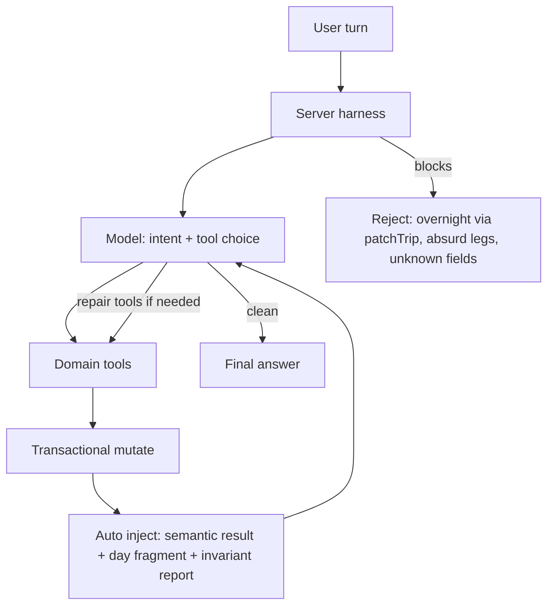

# Plan: viewer chat agent harness

**Status:** implemented (harness shipped).  
**Rollback tag:** `pre-chat-harness` → current baseline before harness code (force-moved with ACL privacy).  
**Related:** [plan-viewer-chat-quality.md](plan-viewer-chat-quality.md) (context/memory work). Dynamic learning (prefs/learnings) stays important; freeze *investment* during harness work and revisit once mutates are safe—especially as a post-repair harness step (see Meta below).

## Goal

Make autonomous chat edits trustworthy by moving reliability from **prompt + prefs/learnings + transcript summary** into **domain tools + a server-enforced agent harness**. No human-in-the-loop Apply button.

**Principle:** the model understands *what*; the application owns *safe how*.  
**Cross-cutting:** every reject/error from the server must be **extensive and actionable** (allowed ops, why blocked, which tool to use next)—same spirit as unknown-field / `getSchema` errors today.

## Architecture target



Desired loop (enforced by the server, not `prompt.txt`):

`understand → inspect → mutate → re-read → validate invariants → repair if needed → answer`

## Phase 0 — Rollback tag

Done:

```bash
git tag -a pre-chat-harness -m "Baseline before viewer-chat harness work"
git push origin pre-chat-harness
```

Undo: check out / redeploy from `pre-chat-harness` (or revert the harness commit range).

## Phase 1 — Tool surface: intent ops + write classes

### 1a. Classify chat tools

| Class | Tools | Behavior |
|-------|--------|----------|
| Read | `getTrip`, `getTripYAML` (day default / `scope=full`), `getSchema`, `listVersions`, `getVersion` | Unchanged |
| Enrichment | `patchTrip` limited to `places.*.info`, `update_day` notes/title **without** route endpoint changes, mid-day `upsert_stop` / `remove_stop` on `stops` (not overnight ends), `setDayPhoto` | Auto-apply; server rejects structural misuse with rich errors |
| Structural | New `changeOvernight`; keep `replaceDayRoutes` as escape hatch / MCP; `restoreVersion` | Transactional; one version; continuity in code. **No separate `undoLastChange`**—improve `listVersions` / `restoreVersion` descriptions + errors so “undo = restore first non-latest” is obvious (see decision below) |
| Meta | prefs / learnings | No new product surface during harness; **optional harness hook**: after a successful repair/correction turn, offer `saveLearning` (same ask-then-save gate). Revisit prefs UX later |

**Decision — no `undoLastChange`:** Yes — a wrapper tool is mostly documentation by another name. Prefer sharper OpenAPI/tool descriptions and error text on `listVersions` + `restoreVersion` (e.g. “to undo the last edit, restore the first entry with `is_latest: false`”). Add `undoLastChange` only if eval shows the model still botches version pick after that.

**Decision — learnings vs multi-round:** Multi-round repair is for *itinerary* correctness in one turn. Saving a learning is optional memory afterward—not a substitute for code invariants. Compatible: freeze new prefs/learnings *features*, but allow the harness to nudge `saveLearning` after a procedural repair once mutates are trustworthy.

### 1b. Server gates on `patchTrip` (chat path)

In viewer-chat tool execution (MCP agent API may stay broader), reject when:

- `days.*.route` full replace, `swap_days`, `delete_day`, `insert_day` used to play overnight games
- `upsert_stop` / `remove_stop` on `list=route` that would change first/last overnight of a travel day
- Errors name the blocked fields and point at `changeOvernight` / `replaceDayRoutes`

### 1c. Transactional tools + tool/doc/error review

OpenAPI `x-audiences: [chat]` (+ handlers in `internal/viewerchat`).

**Pass over all chat tools:** descriptions, parameter docs, and error strings audited so the agent can self-correct (include in Phase 1 ship checklist—not a separate science project).

**`changeOvernight`**

- Args: `day`, `new_end` place id (or create place inline), optional `title`, optional `also_update_next_start` (default true).
- Server: rewrite day N end + day N+1 start; preserve N+1 mid/end; normalize overnight types; one version; return semantic result (below).
- Validate overnight→overnight distance (reject absurd legs unless an explicit escape such as `force` for ferry/flight days later).

Keep `replaceDayRoutes` for multi-stop route surgery / MCP; chat should prefer `changeOvernight` for the common overnight case.

### 1d. Semantic mutation returns

Every mutate tool returns JSON like:

```json
{
  "ok": true,
  "op": "changeOvernight",
  "version_id": "...",
  "changed": { "day": 12, "old_end": "hokitika", "new_end": "franz-josef" },
  "derived_changes": { "day_13_start": { "old": "hokitika", "new": "franz-josef" } },
  "preserved": ["day_13.route.mid", "day_13.route.end"],
  "warnings": [],
  "trip_fragment": {},
  "invariants": { "continuity_ok": true, "issues": [] }
}
```

Extend `handlePatchTrip` / `handleReplaceDayRoutes` the same way (diff summary + fragment + continuity). Stop returning bare `{"ok": true}` for mutates.

## Phase 2 — Enforced agent loop (+ Persona / latency)

Today: naïve Responses loop in [`internal/viewerchat/agent.go`](../internal/viewerchat/agent.go) (`maxToolIterations = 8`) with prompt text saying “verify.”

**Persona fit:** Yes—without Persona changes for multi-round *logic*. The extra mutate→validate→repair iterations run **inside one** `POST /api/chat` Responses loop; Persona already streams SSE until that request finishes. It does not need to orchestrate the repair rounds.

**Latency / UX (do budget this):** More OpenAI round-trips ⇒ longer wall time. Check and likely raise:

- Server request / proxy idle timeouts (CloudFront, ALB/Express, Go server) so the SSE connection isn’t killed mid-repair
- Persona/widget client expectations (loading state already; ensure no aggressive client abort)
- Optional: stream a lightweight SSE status event (“checking itinerary…”) so the UI doesn’t look stuck—nice-to-have, not a harness blocker

Change:

1. After **any** successful mutate, the server **appends** a developer/tool follow-up with semantic result + `trip_fragment` + invariant issues (not optional prompt memory).
2. If invariants fail or a lightweight “requested field changed?” check fails, force another model iteration: repair via tools or explain failure; do not claim success.
3. Cap repair iterations (e.g. 2), then surface the error to the user.
4. Prefer attaching day-scoped YAML / fragment on the mutate result so verify is automatic.

Shrink [`prompt.txt`](../internal/viewerchat/prompt.txt): drop verify recipes now owned by the harness; keep identity, tone, metric, photos.

## Phase 3 — Structured working state

Heuristic “last 8 + summary” can destroy negations (“don’t remove Hokitika”). Do not make prose summary the primary long-term thread state.

Inject a small structured object each turn, e.g.:

```yaml
active_intent: { op, day, target }
constraints: { preserve: [], do_not: [] }
recent_corrections: []
last_mutation: { op, version_id, ok }
```

- Authoritative bits come from the last server mutate result; soft bits from recent turns.
- Cancel language (`nm`, `never mind`, `stop`): clear `active_intent` and **suppress further mutates this turn** unless the user issues a new clear ask.
- Keep ~6–8 verbatim messages; summary is optional gloss only.

## Phase 4 — Eval (end-state)

Add cases under `internal/viewerchat/eval/` (or `testdata/chat_eval/`) from real failures:

- Day vs stop notes; `opening_hours` under logistics; coffee stop ≠ rewrite endpoints; NM = no mutate; overnight preserves next mid stops; undo via `restoreVersion`; continuity.

Each case: frozen YAML + turns + **final YAML assertions** (tool choice is diagnostic only). Scripted model double in CI; optional live smoke later.

## Phase 5 — Non-goals

- No Apply button / HITL.
- No major prefs/learnings product work during harness (optional post-repair `saveLearning` nudge only).
- No “more prompt bullets” as the primary strategy.
- Disabling chat remains an ops escape hatch if the harness regresses.

## Ship order

1. ~~Tag `pre-chat-harness` + this doc~~ (done)
2. Semantic mutate returns + continuity on existing mutates + rich errors
3. Chat gates on structural `patchTrip`
4. `changeOvernight` + versioning tool doc/error pass (no `undoLastChange` unless eval demands it)
5. Chat tool description/error audit
6. Enforced post-mutate validate/repair loop + timeout/SSE sanity check
7. Structured working state + cancel handling
8. Eval suite
9. Prompt trim + `./scripts/deploy-compute.sh` (and `--patch-viewer` only if status SSE needs UI)

## Success criteria

- Day-4-style “coffee → Greymouth overnight” is **rejected or impossible** via tools/gates without babysitting.
- Note/hours edits verify via harness; fewer false “done” claims in logs.
- Overnight change is one tool call with continuity preserved in code.
- `git checkout pre-chat-harness` (+ redeploy) restores prior behavior cleanly.
