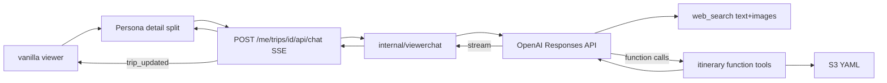

# Plan: in-viewer OpenAI chat (Persona)

**Status:** implemented (v1 chat + itinerary tools); **v1.1 deployed** (`chat-sse-20260809234123`) — Responses API + `web_search`; SSE flush/heartbeats; CF origin read timeout 60s.  
**Overview:** Persona (vanilla JS) chat in the signed-in tripmap viewer, backed by a streaming `tripmapd` endpoint that tool-calls itinerary ops and (v1.1) OpenAI hosted web/image search — no React, no Vercel, no browser API keys.

## Goal

Let signed-in viewers nudge the open itinerary from the PWA without switching to ChatGPT/Codex: a **Persona** chat panel that streams replies, looks up trails / hours / photos on the web, and applies edits via the same trip operations MCP already uses.

## Locked decisions

- **UI:** [Persona](https://www.persona-chat.dev/) (`@runtypelabs/persona`) — vanilla JS, **docked into the detail column** (vertical split: day body above, chat below when open). No floating FAB; open/close from the detail-chrome **Ask** toggle (robot icon). No React / no assistant-ui.
- **Viewer:** keep vanilla [`internal/bundle/viewer/app.js`](../internal/bundle/viewer/app.js); mount Persona with `initAgentWidget` + Shadow DOM into `#persona-dock-host` inside `#detail-chat`. Load Persona CSS as `link[data-persona]` (cloned into the shadow root). `#detail` is a column flex; `#detail-body` and `#detail-chat` scroll independently. Day-nav keys/swipes must ignore Shadow DOM / chat pane via `composedPath`.
- **No Vercel** hosting or Vercel AI SDK.
- **OpenAI:** official **Go SDK** in `tripmapd` only; key from env/Secrets Manager (`OPENAI_API_KEY` / `OPENAI_SECRET_JSON`), never in the browser.
- **Agent API (v1.1):** prefer **Responses API** with hosted `{ "type": "web_search" }` (text + **image** results) plus custom function tools for itinerary ops. Chat Completions alone cannot host `web_search` with image results.
- **Backend shape:** put **all/most** of the chat agent loop in [`internal/viewerchat`](../internal/viewerchat); `httpserver` only authenticates and delegates.
- **Auth:** viewer session cookie after Hellō login (same as comments) — not agent Bearer. Persona `customFetch` sends `credentials: "include"`.
- **Security (chat):** separate allowlist (`config/chat-allowlist.csv`); 503 if OpenAI unset; cap message size / tool iterations.
- **Itinerary tools (server only):** in-process trip ops (summary / schema / YAML / patch), same semantics as MCP — S3 patches stay in `tripmapd`. **Not** Persona WebMCP page tools for mutating YAML.
- **Web research (v1.1):** OpenAI hosted `web_search` for opening times, trail conditions, logistics, etc. No separate Bing/Tavily secret unless we later add a fallback.
- **Photos (v1.1):** still **URL-only** in YAML (`photo` / `photo_caption`) — tripmap does not host image bytes. Flow: `web_search` with `search_content_types: ["image","text"]` → optional vision review of candidate `image_url`s → `patch_trip` / `update_day` with the chosen HTTPS URL. Prefer stable sources (Wikimedia, official tourism); hotlink/license risk accepted; broken URLs may still happen.
- **Page tools:** out of scope. Optional later for UI-only actions (jump to day) after `trip_updated`; never for SoT writes.
- **Context (server-assembled each turn):** system prompt + compact trip card + last N messages + tool results. Prefer tools over stuffing full multi-week YAML every turn.
- **History v1:** Persona/client-held thread (session); server mostly stateless per request.
- **Out of scope:** Codex/MCP changes, Custom GPT Actions, billing UI, multi-model picker, WebMCP page tools, shared-comments tools, embedding/uploading photo files into S3.

## Backend (`tripmapd`)

Most logic lives in [`internal/viewerchat`](../internal/viewerchat); `httpserver` only authenticates and delegates.

1. **Config:** `OPENAI_API_KEY` / `OPENAI_SECRET_JSON`, `OPENAI_MODEL`, chat allowlist. Secrets Manager `tripmap/openai` (created out-of-band); data stack exports ARN + grants task execution role read.
2. **Route:** `POST /me/trips/{id}/api/chat` under session trip gate (`handleSessionTrip`). API paths return 401 JSON (not login redirect).
3. **Agent loop (v1.1):** Responses API; tools = hosted `web_search` + function tools from [`api/openapi.yaml`](../api/openapi.yaml) filtered with `x-audiences: chat` via [`mcpopenapi.ParseToolSchemasOpts`](https://github.com/yaronf/mcpopenapi) (`getSchema` / `getTrip` / `getTripYAML` / `setDayPhoto` / `listVersions` / `getVersion` / `restoreVersion` / `patchTrip`), scoped to `{id}`. System prompt is embedded [`prompt.txt`](../internal/viewerchat/prompt.txt).
4. **After successful patch:** emit `trip_updated` SSE so the viewer reloads `trip.json`.
5. **Security:** signed-in session **plus** chat allowlist; 503 if OpenAI unset; cap message size / tool iterations.

## Frontend

1. Persona via CDN (`index.global.js` + `widget.css` with `data-persona`); [`chat.js`](../internal/bundle/viewer/chat.js) mounts only when `/auth/me` has `chat_enabled`.
2. Docked fill of `#detail-chat` (100% dock width + CSS vertical split on `body.chat-open`); detail-chrome toggle; paper/teal theme tokens; `customFetch` + `parseSSEEvent`; pass current day in context.
3. On `trip_updated`, `window.tripmap.reloadTrip()`.

## Docs / ops

- `.env.example`, runbook: OpenAI secret, chat allowlist, Persona widget.
- Deploy: ECS injects `OPENAI_SECRET_JSON`; regen trip bundles after viewer shell changes.

## Implementation todos

1. [x] `internal/viewerchat` (+ thin session-authed route): tool loop over itinerary ops; SSE; chat allowlist.
2. [x] Mount Persona in detail-column split; credentials include; reload trip on patch; layout/keyboard fixes for Shadow DOM.
3. [x] Config/secret wiring, docs/TODO; dark-ship without key.
4. [x] **v1.1:** Responses API + `web_search` / `web_search_preview` (text + images); prompt for research + photo URL selection; itinerary function tools; tests; image `chat-web-20260809202725` deployed.

## Tests

- Handler unit test: unauthenticated → 401; not on chat allowlist → 403; no API key → 503; mocked tool loop calls patch once for a fixture trip.
- Smoke: Persona mounts; SSE parse; (v1.1) research turn returns citations / photo URL patch without crashing the loop.
