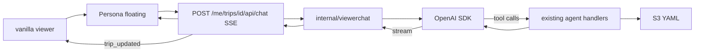

# Plan: in-viewer OpenAI chat (Persona)

**Status:** planned (not implemented).  
**Overview:** Persona (vanilla JS) chat in the signed-in tripmap viewer, backed by a streaming `tripmapd` endpoint that tool-calls the existing agent handlers — no React, no Vercel, no browser API keys.

## Goal

Let signed-in viewers nudge the open itinerary from the PWA without switching to ChatGPT/Codex: a **Persona** chat panel that streams replies and applies edits via the same trip operations MCP already uses.

## Locked decisions

- **UI:** [Persona](https://www.persona-chat.dev/) (`@runtypelabs/persona`) — vanilla JS, **floating** launcher (not docked). No React / no assistant-ui.
- **Viewer:** keep vanilla [`internal/bundle/viewer/app.js`](../internal/bundle/viewer/app.js); mount Persona with `initAgentWidget` + Shadow DOM (no style fights with Leaflet).
- **No Vercel** hosting or Vercel AI SDK.
- **OpenAI:** official **Go SDK** in `tripmapd` only; key from env/Secrets Manager (`OPENAI_API_KEY`), never in the browser.
- **Backend shape:** put **all/most** of the chat agent loop (OpenAI client, tool wiring, SSE) in a **separate package** (e.g. `internal/viewerchat`), not sprawled across `httpserver`. HTTP route stays a thin session-authed wrapper on the viewer trip paths.
- **Auth:** viewer session cookie after Hellō login (same as comments) — not agent Bearer. Persona `customFetch` sends `credentials: "include"`.
- **Security (chat):** separate allowlist / authz for chat (not every signed-in Hellō user); 503 if OpenAI unset; cap message size / tool iterations.
- **Itinerary tools (server only):** in-process calls to existing agent handlers (`api.ServerInterface` / OpenAPI), same semantics as MCP — S3 patches stay in `tripmapd`. **Not** Persona WebMCP page tools for mutating YAML.
- **Page tools:** out of scope v1. Optional later for UI-only actions (jump to day, focus stop) after a server `trip_updated` event; never for SoT writes.
- **Context (server-assembled each turn):** system prompt + compact trip card (id, title, current day from client, short YAML/summary) + last N messages + tool results. Prefer tools over stuffing full multi-week YAML every turn.
- **History v1:** Persona/client-held thread (session); server mostly stateless per request. No cross-device resume in v1.
- **Out of scope v1:** Codex/MCP changes, Custom GPT Actions, billing UI, multi-model picker, WebMCP page tools, shared-comments tools (separate TODO).

## Backend (`tripmapd`)

Most logic lives in a dedicated package (e.g. [`internal/viewerchat`](../internal/httpserver)); `httpserver` only authenticates and delegates.

1. **Config:** `OPENAI_API_KEY`, model name (e.g. `OPENAI_MODEL`), optional rate limit; chat allowlist path/env. Wire into [`internal/httpserver`](../internal/httpserver) config like other secrets.
2. **Route:** `POST /me/trips/{id}/api/chat` under existing session trip gate (`handleSessionTrip`).
   - Body: messages + optional `day` / client context (adapt to whatever Persona posts; use `parseSSEEvent` / `customFetch` on the client if shapes differ).
   - Response: **SSE** stream of assistant text (+ tool progress if useful); document the event format Persona’s parser expects and match it (or ship a thin `parseSSEEvent`).
3. **Agent loop** (in `viewerchat`): OpenAI tool-calling; each tool maps to `/api/agent/*` handler logic (get schema / get trip / patch trip as needed), **scoped to `{id}`**.
4. **After successful patch:** emit `trip_updated` (SSE event or trailer) so the viewer reloads `trip.json` / geo without a full page refresh.
5. **Security:** signed-in viewer session required **plus** separate chat allowlist/authz; 503 if OpenAI unset; cap message size / tool iterations.

## Frontend

1. **Deps:** add `@runtypelabs/persona` to the viewer (script tag or small bundled entry next to `app.js` — prefer the lightest path that still embeds cleanly in the PWA/CLI bundle).
2. **Mount:** `initAgentWidget` with `apiUrl` → `/me/trips/{id}/api/chat`, **floating** launcher; theme tokens aligned with viewer chrome.
3. **Transport:** `customFetch` with session cookies; `parseSSEEvent` if the Go stream is not Persona’s default shape.
4. **Reload:** on `trip_updated`, call existing viewer reload/fetch in `app.js`. Pass current day into chat context when sending.

## Docs / ops

- README or runbook: enable key, model, viewer session + chat allowlist, Persona floating widget.
- TODO: track “in-viewer OpenAI chat (Persona)” (already linked from [`TODO.md`](../TODO.md)).
- Deploy: same ECS image; new secret when ready (dark-ship until key set).

## Implementation todos

1. `internal/viewerchat` (+ thin session-authed route): OpenAI Go SDK tool loop over agent handlers; SSE shape Persona can parse; chat allowlist.
2. Mount Persona **floating** widget in the vanilla viewer; credentials include; reload trip on patch.
3. Config/secret wiring, docs/TODO, dark-ship without key; theme tokens to match viewer.

## Tests

- Handler unit test: unauthenticated → 401; not on chat allowlist → 403; no API key → 503; mocked OpenAI tool loop calls patch once for a fixture trip.
- Smoke: Persona mounts in viewer shell; SSE parse against a recorded fixture stream.
